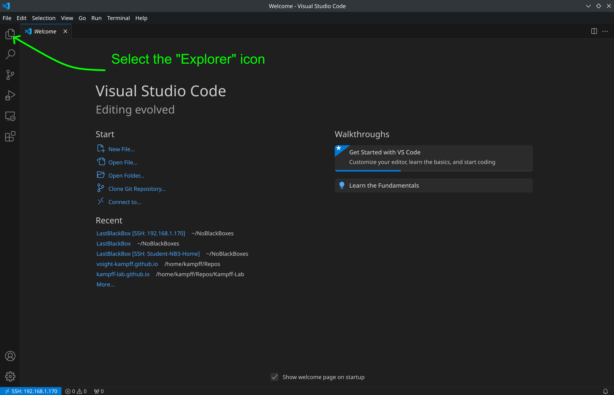
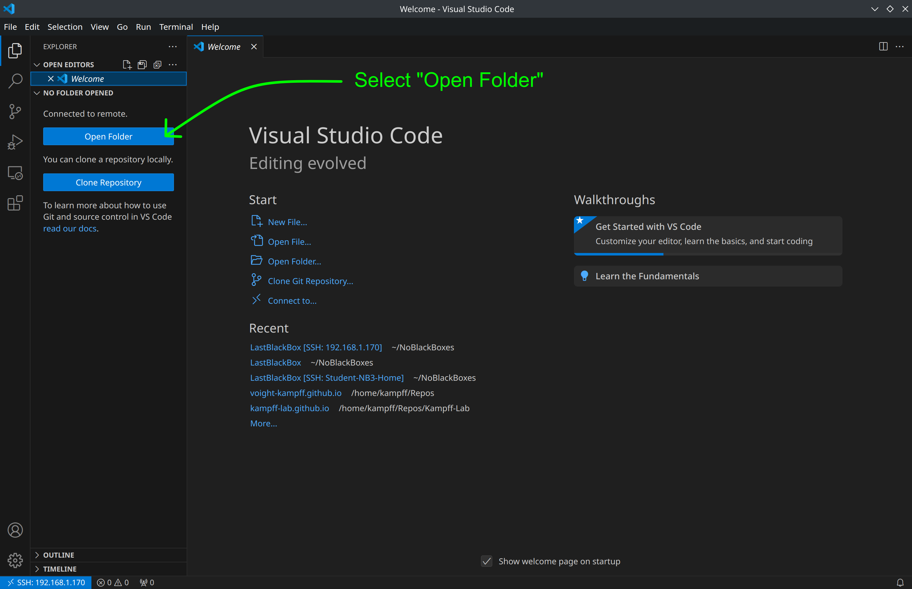
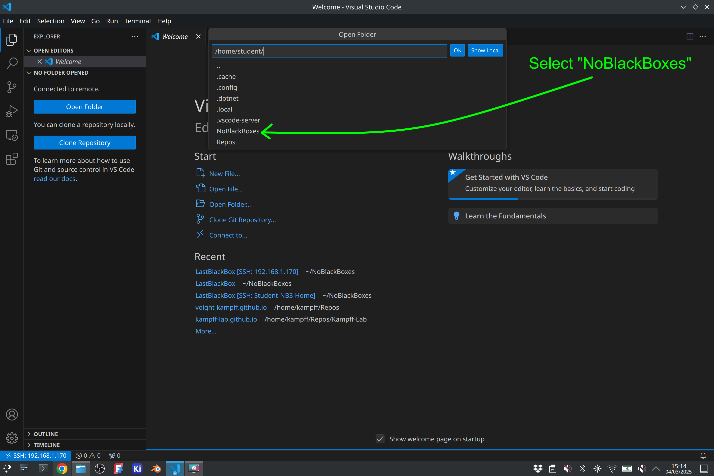
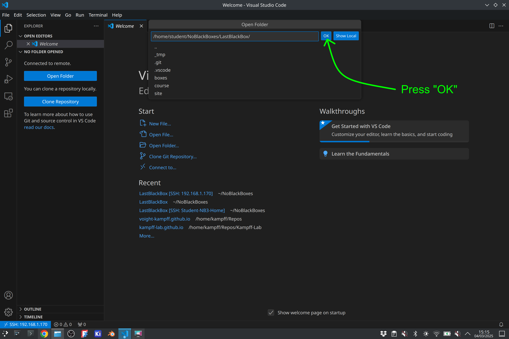
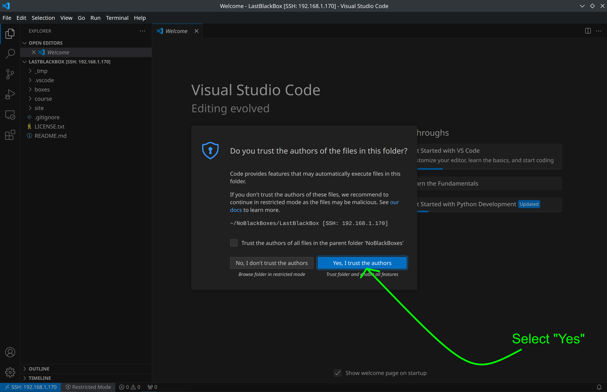
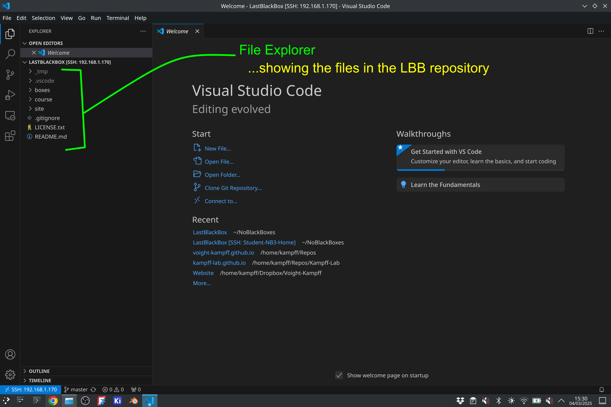
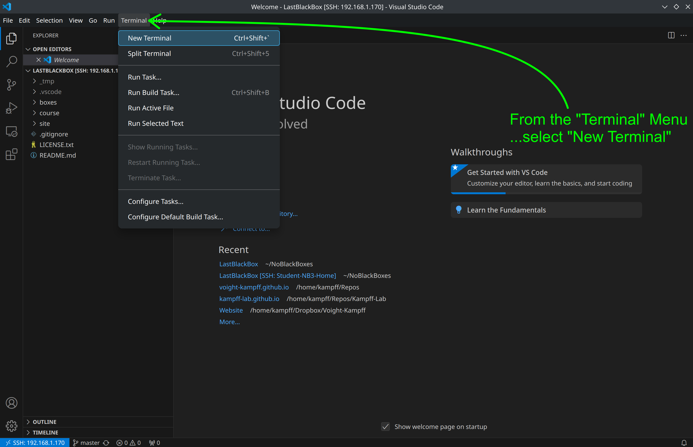
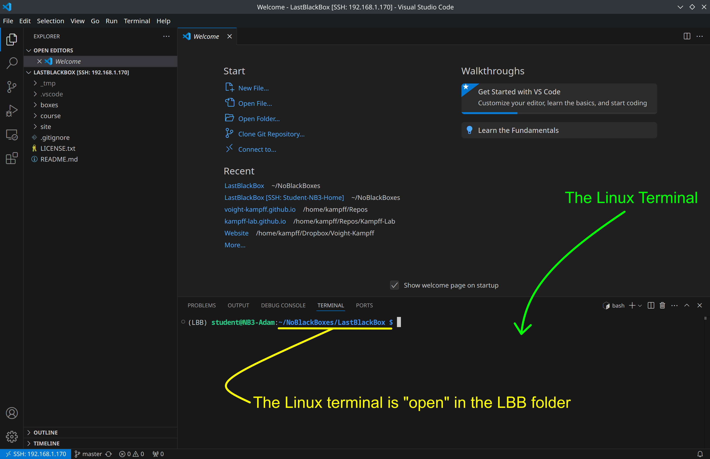
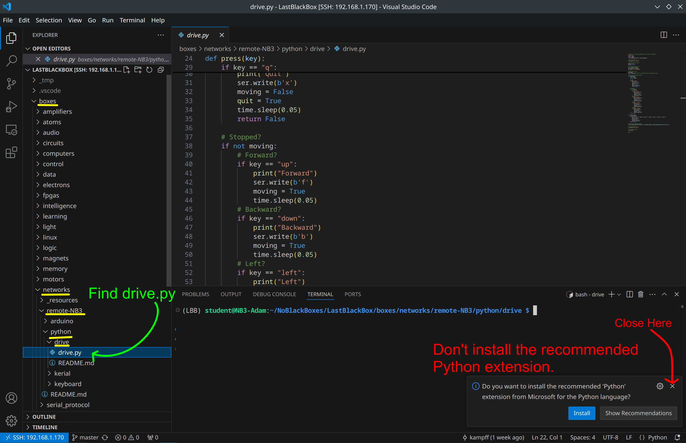
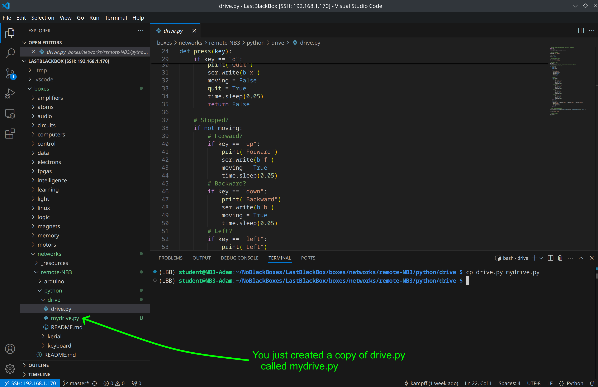

# Linux and Visual Studio Code
We will interact with the Linux operating system on your NB3's Raspberry Pi using Visual Studio Code. 

## Requirements
1. You have VS Code *and* the Remote-SSH extension installed
2. You are connected to your NB3 via SSH

## Setting Up Visual Studio Code
When you first connect to your NB3, then you will see a rather empty window...with perhaps a "Welcome" screen. The first thing you should *always* do after connecting to your NB3 is to "Open a Folder" in VS Code.

- Select the "Explorer" Icon.



- A new menu will appear. Select the "Open Folder" button.



- Navigate to the "LastBlackBox" folder: select "NoBlackBoxes, then "LastBlackBox", then press OK.






VS Code will now re-open *inside* the selected folder. A pop-up window will appear the first time you do this, asking if you *"Trust"* the creators of this folder and its contents. We created it...so...do you trust us? Select "yes".



The "Explorer" will now show the files and folders inside the "LastBlackBox" folder, which are the same files in the online [GitHub repository](https://github.com/NoBlackBoxes/LastBlackBox).



You can use the "Explorer" to find files to edit by navigating through the folders and sub-folders of the repository. It is very convenient.

However, you will also need to "run" the code in some of these files...and for that we will use the Linux terminal. Fortunately, there is a Linux terminal built into VS Code!

- Open a Linux terminal in VS Code



You should now have a new window at the bottom of VS code. This is your Linux terminal!



We will now use this terminal to enter commands, navigate through folders, make some files, and start playing with our NB3.

## Navigating Linux (using only the command line)
Linux is based on text commands. Instead of "clicking" on icons or "tapping" on apps, you will write commands to accomplish the same thing. At first, this *will* feel awkward, but after awhile you might just find that it is actually faster than pointing a mouse cursor all over the screen.

We will now start learning some basic Linux commands. You enter these by typing them directly into the Terminal window and pressing <Enter>.

Let's first see where we are, enter the following command (pwd) to "print the working directory".

```bash
pwd
```

This command will print out the name of the folder (a.k.a. "directory") where you are currently working in Linux. It will likely be the "LastBlackBox" folder, but with the full path to this folder, e.g. /home/student/NoBlackBoxes/LastBlackBox

Let's now see what is inside the current folder with the (ls) command, which will *list* the current folder's contents.

```bash
ls
```

The command will print out all of the files and folders in the current working directory.You will see the "boxes" folder, where a lot of the useful examples for this course are and the "course" folder...where the documentation for this course is located. You should als see a "_tmp" folder, which is a folder we have used to store "temporary" data and other resources that are not uploaded to GitHub repository. You will also see a few files...link the License and main README file.

Let's now change folders with the command (cd) to "change directory"

```bash
cd boxes
```

This will change your current working directory to the boxes folder. You can now check the contents of this folder with (ls).

```bash
ls
```

The command will print out a list of all the different "black boxes" we are opening during this course. Let's navigate to the box containing the example code for driving around your NB3!

```bash
cd networks/remote-NB3/python/drive
```

Here we navigate through multiple folders with one command. If you check the contents of this folder, you should see a single file called **drive.py**. This is a Python file that listens for key presses and then sends commands to your Arduino to cause the NB3 to move.

Run this Python code (be careful! your NB3 will start moving if you press the arrow keys...make sure you don't drive it off the table)

```bash
python drive.py
```

This command runs Python and then sends it the **drive.py** file. Whatever code is in the **drive.py** will be run line-by-line by the Python interpreter.

What if we want to change this Python code?

We can find this file in the VS Code "Explorer" by navigating through the same sequence of folders, "boxes" -> "networks" -> "remote-NB3" -> "python" -> "drive", and clicking on **drive.py**.



- *Note*: A pop-up might appear asking you to install the recommended Python extension. Just close the pop-up for now. We won't use the Python extension at the moment (...perhaps in the future).

Now, back in the Linux terminal, let's create a copy of **drive.py** called **mydrive.py**, which will be a version that you can edit and improve anyway you want to!

Use the (cp) command to copy the contents of **drive.py** to **mydrive.py**

```bash
cp drive.py mydrive.py
```

When you run this command, you should see the file you just created (**mydrive.py**) appear in the VS Code Explorer.



Open **mydrive.py** by clicking on it in the VS Code Explorer. You can now change this file however you like to *change* how your NB3 responds to keypresses (some suggestions below).

When you want to try out your changes, then you can test them by running **mydrive.py** in the Linux terminal.

```bash
python mydrive.py
```

---

This process of opening the LBB folder in VS Code, navigating to a file in the Linux terminal, editing a copy of the file in the VS Code window, and running the new version in the terminal is the process you will repeat over-and-over again as you develop your own behaviour's for your NB3. It might seem cumbersome at first, but you will get the hang of it in no time!

## Playing with Python
Let's make the NB3 do a little dance on demand!

We will be editing the **mydrive.py** we just created. We will try to make the NB3 respond to a new keyboard command. Here will add some Python code to make the robot respond to the "d" key by performing some dance moves.

Find this section of code in the **mydrive.py** file.

```python
    # Stopped?
    if not moving:
        # Forward?
        if key == "up":
            print("Forward")
            ser.write(b'f')
            moving = True
            time.sleep(0.05)
        # Backward?
        if key == "down":
            print("Backward")
            ser.write(b'b')
            moving = True
            time.sleep(0.05)
        # Left?
        if key == "left":
            print("Left")
            ser.write(b'l')
            moving = True
            time.sleep(0.05)
        # Right?
        if key == "right":
            print("Right")
            ser.write(b'r')
            moving = True
            time.sleep(0.05)
    return True
```

This code is where (if the NB3 is not moving) we respond to keys pressed by sending serial commands to the Arduino. Let's add a new piece of code to respond to a new key press, ("d"). Change this code section to look like the following (you can cut paste the whole section, or just the new part...but make sure you keep the indentation the same because Python really cares about indentation!)

```python
    # Stopped?
    if not moving:
        # Forward?
        if key == "up":
            print("Forward")
            ser.write(b'f')
            moving = True
            time.sleep(0.05)
        # Backward?
        if key == "down":
            print("Backward")
            ser.write(b'b')
            moving = True
            time.sleep(0.05)
        # Left?
        if key == "left":
            print("Left")
            ser.write(b'l')
            moving = True
            time.sleep(0.05)
        # Right?
        if key == "right":
            print("Right")
            ser.write(b'r')
            moving = True
            time.sleep(0.05)
        # Dance?
        if key == "d":
            moving = True
            print("Dancing...")
            ser.write(b'r')   # Go right
            time.sleep(0.5)   # Wait 0.5 seconds
            ser.write(b'f')   # Go forward
            time.sleep(0.25)  # Wait 0.25 seconds
            ser.write(b'l')   # Go left
            time.sleep(0.5)   # Wait 0.5 seconds
            ser.write(b'b')   # Go backward
            time.sleep(0.25)  # Wait 0.25 seconds
            ser.write(b'x')   # Stop
            print("...Done")
            moving = False
    return True
```

Congrats! You made your first new behaviour....***Have Fun!***