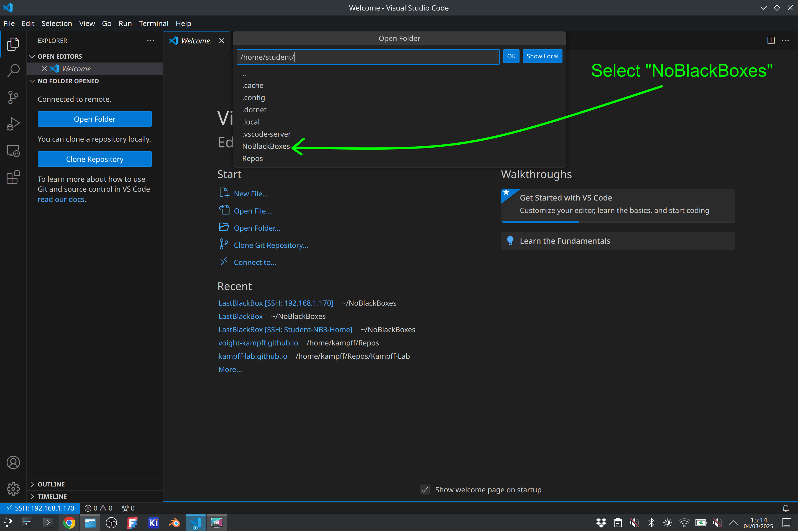
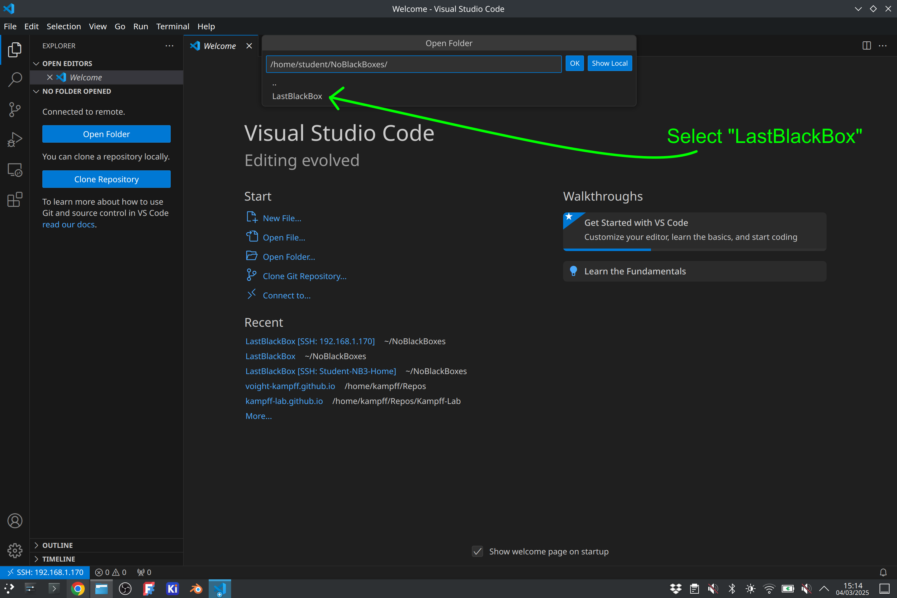
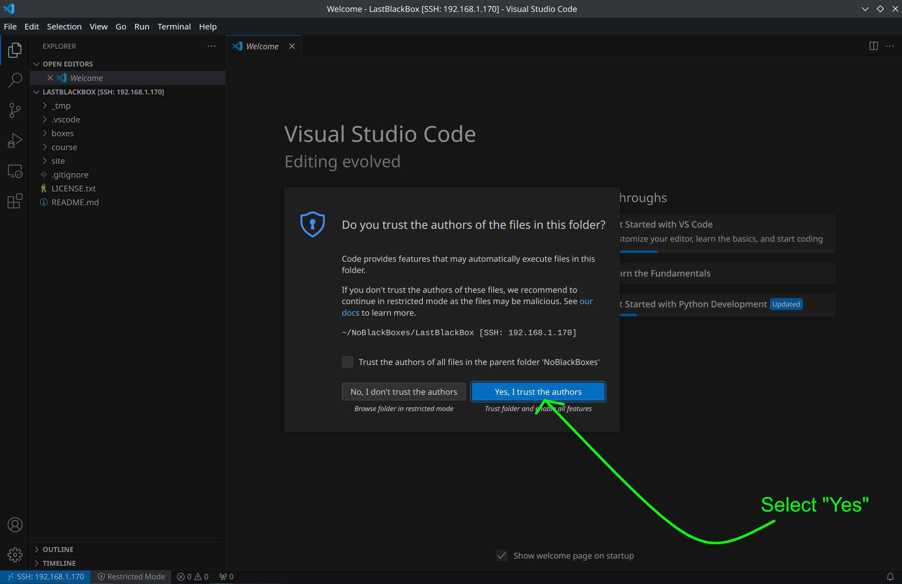
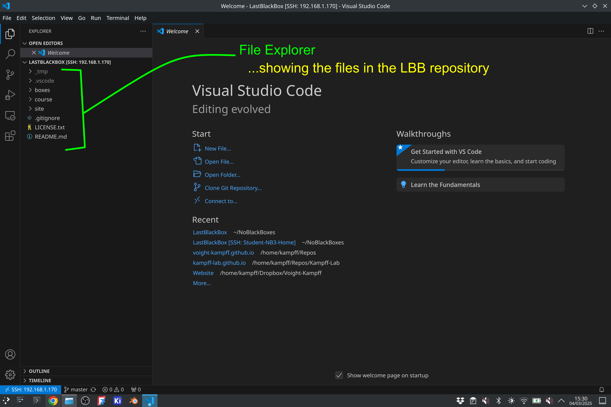
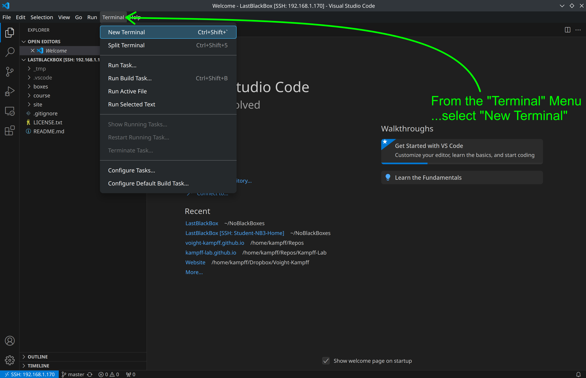
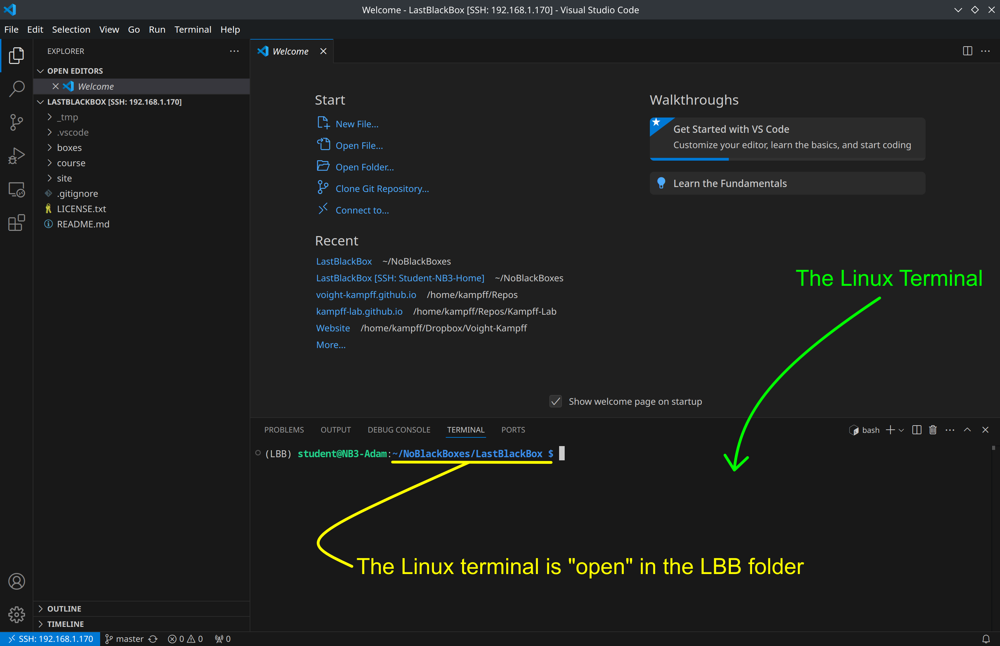

# Setting Up Visual Studio Code
Instructions for setting up VS Code to work on LBB projects

## Requirements
1. You have VS Code *and* the Remote-SSH extension installed
2. You are connected to your NB3 via SSH

## Open the LBB folder
When you first connect to your NB3, then you will see a rather empty window...with perhaps a "Welcome" screen. The first thing you should *always* do after connecting to your NB3 is to "Open a Folder" in VS Code.

- Select the "Explorer" Icon.

- A new menu will appear. Select the "Open Folder" button.

- Navigate to the "LastBlackBox" folder: select "NoBlackBoxes, then "LastBlackBox", then press OK.

VS Code will now re-open *inside* the selected folder. A pop-up window will appear the first time you do this, asking if you *"Trust"* the creators of this folder and its contents. We created it...so...do you trust us? Select "yes".

The "Explorer" will now show the files and folders inside the "LastBlackBox" folder, which are the same files in the online [GitHub repository](https://github.com/NoBlackBoxes/LastBlackBox).

You can use the "Explorer" to find files to edit by navigating through the folders and sub-folders of the repository. It is very convenient.

However, you will also need to "run" the code in some of these files...and for that we will use the Linux terminal. Fortunately, there is a Linux terminal built into VS Code!

- Open a Linux terminal in VS Code

You should now have a new window at the bottom of VS code. This is your Linux terminal!

We will now use this terminal to enter commands, navigate through folders, make some files, and start playing with our NB3.
