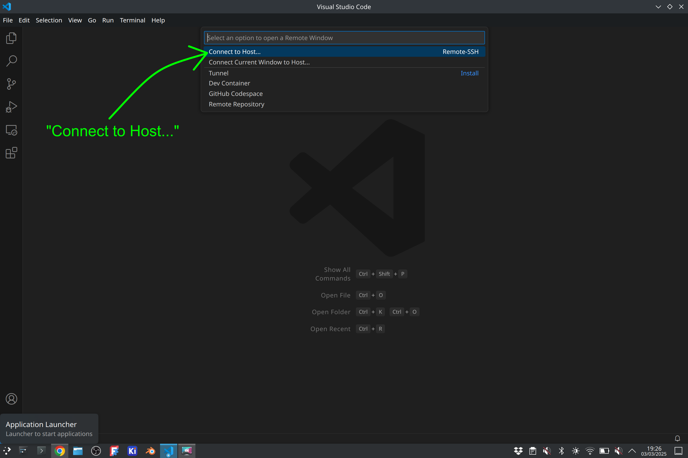
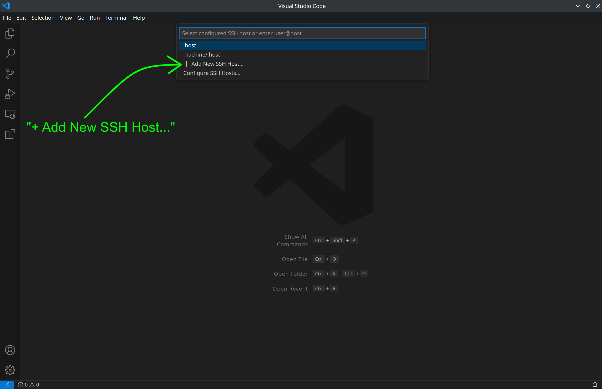
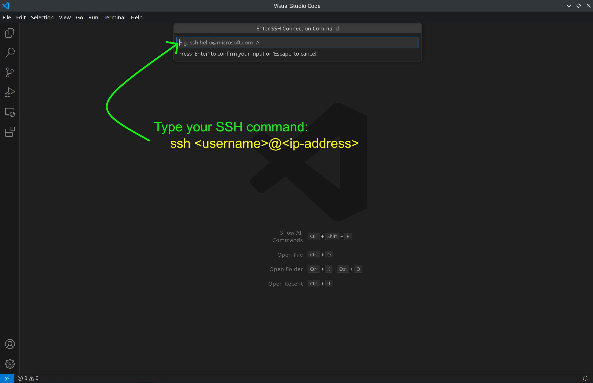
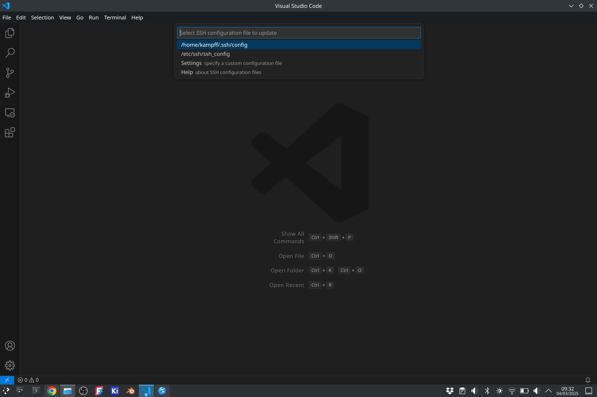
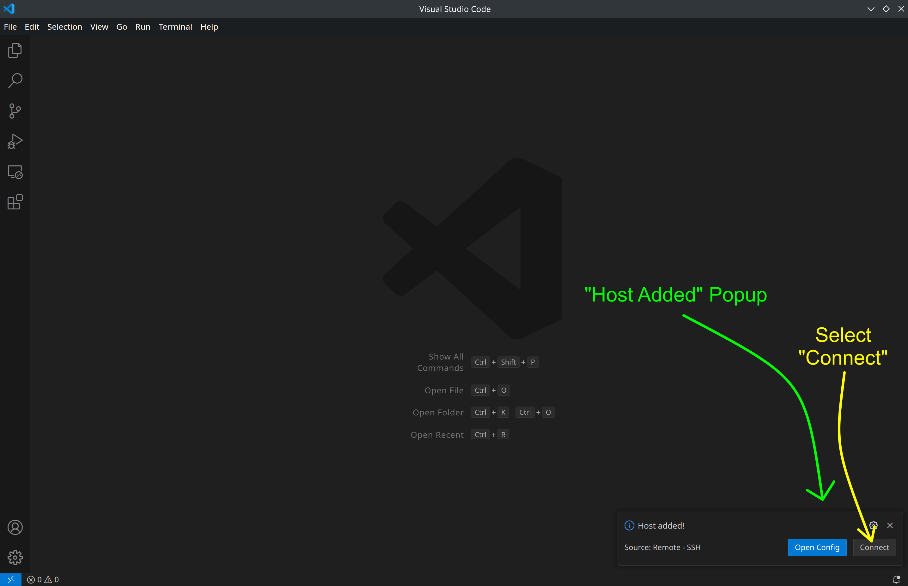
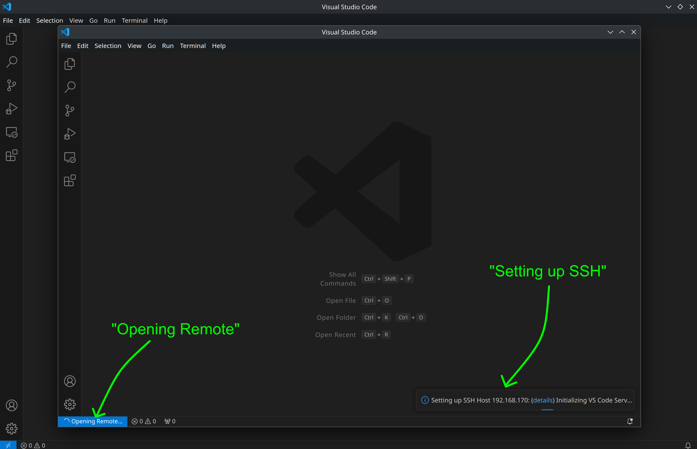
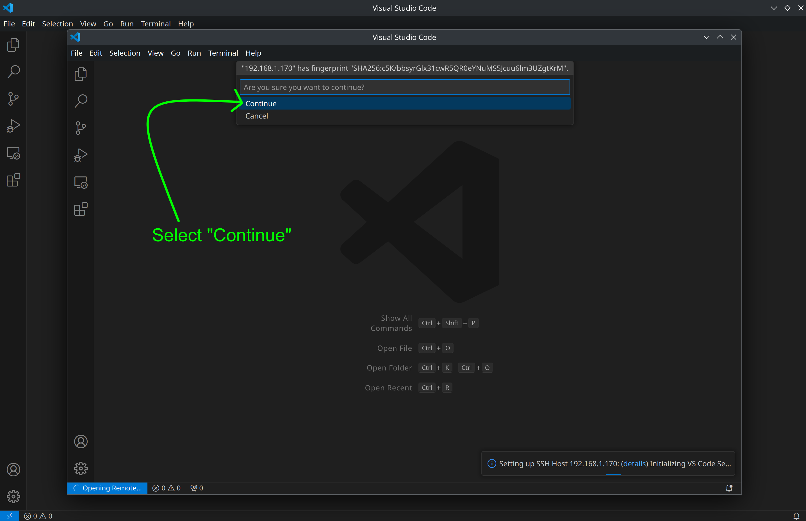
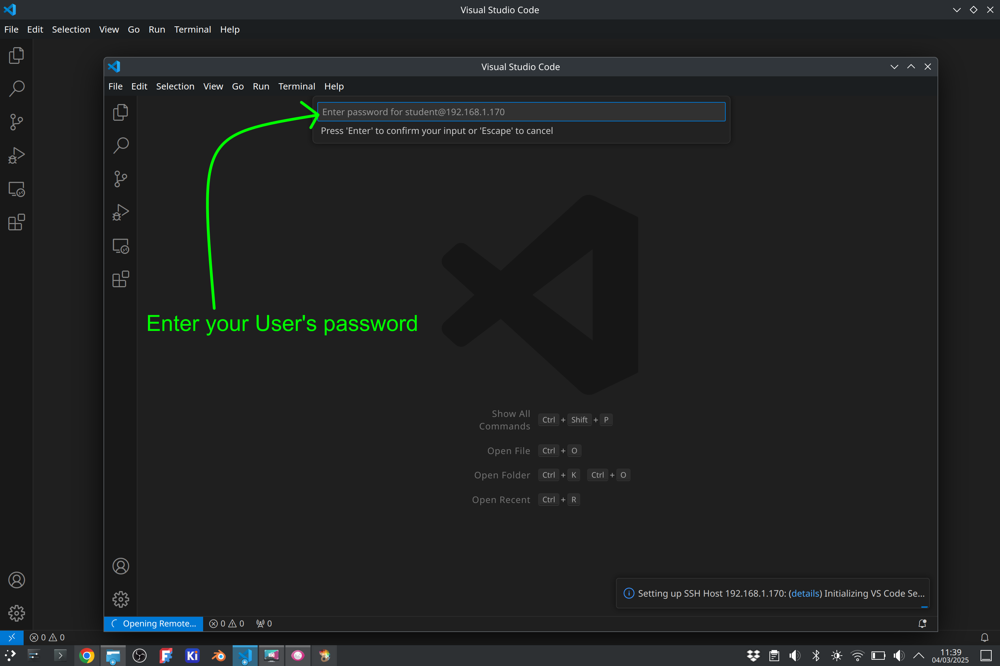
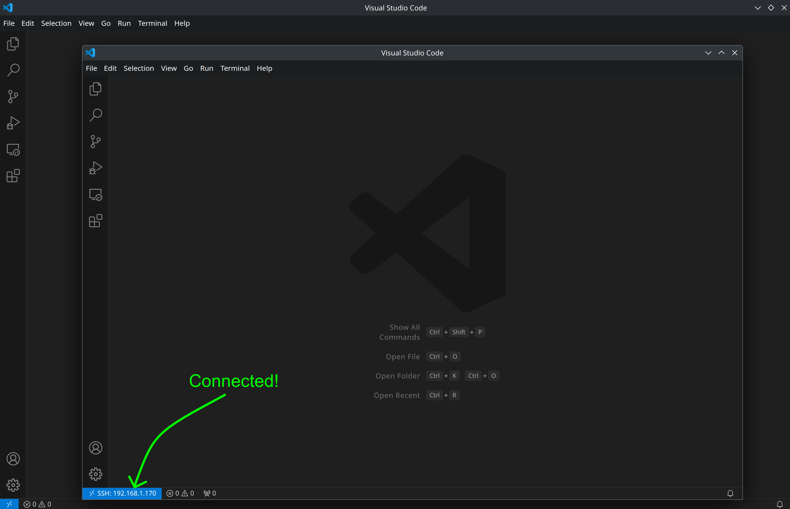
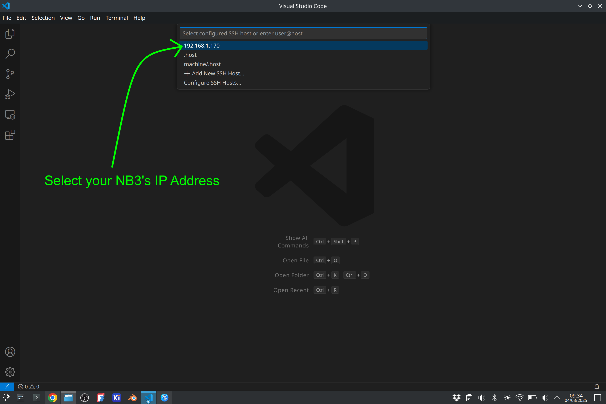

# SSH with Visual Studio Code
Connecting to a remote computer (such as your NB3's Raspberry Pi) via SSH using Visual Studio Code.

## Requirements
1. You are connected to the same network as your NB3
2. You have VS Code *and* the Remote-SSH extension installed

## Fist Connection
The first time you connect to your NB3, your computer will have no idea who this new computer is. It will therefore ask you to confirm that you do indeed want to connect and it will *store* some useful info about this connection.

- Select the Icon to "Open a Remote Window"


- A dialog window will appear, select "Connect to Host..."



- Another dialog will appear, select "+ Add New SSH Host"



- And yet another dialog will appear asking you to enter your SSH connection command. Enter the SSH command to connect your **USER** to your **NB3's IP Address**.

```txt
ssh <your-user-name-on-NB3>@<your-NB3's-IP-address>

# Example
ssh student@192.168.1.170
```



- You will then be asked where to save the SSH configuration. Select the first (default) option, which will save the details (username and IP address) of your SSH connection into this file. *Note*: It is a good idea to wite down this location, as you may need to access this "config" file (or other files in the same folder) in the future...if something goes wrong.



- A pop-up will now appear telling you that a new host has been added to the "config" file and asking if you want to open this file or "Connect". Select "Connect".



- A new window will now open in which VS code will attempt to connect to your NB3 via SSH. You will see a variety of messages as the connection is formed...



- ...if all goes well, then you will see a dialog appear telling you that the computer (at a particular IP Address) you are connecting to has a particular "fingerprint". This fingerprint is a long number that *summarizes* the details of your NB3's hardware and software. Select "continue". 
  - *Note*: This is a security check. If someone were to secretly *change* the computer at the IP address that was previously assigned to your NB3, then this fingerprint will change...and VS code/SSH will prevent you from connecting to this new (potentially malicious) computer. Often, however, *you* will be the one that changes the software of your NB3 (if, for example, you were to re-install the NB3's Operating System), which is common cause of connection issues. Instructions for re-connecting to an altered NB3 will be discussed below in the "troubleshooting" section.



- You will now be asked to enter your user's password.



- That's it. If all goes well, then you will be connected to your NB3!



## Reconnection
Reconnecting to your NB3 is much easier (and faster) as VS code will remember many of the details from your first connection.

- Open VS code and select the "Open a Remote Window" Icon.


- Select "Connect to Host" in the dialog window.


- A new dialog will appear showing your stored SSH configurations. Select your NB3's IP address.



- You should now be prompted to enter your password.


- If all goes well, then you will be connected to your NB3!


## Troubleshooting

There is a lot going on when a remote (secure) connection is formed between computers...and thus there is a lot that can go *wrong*. Below are some steps to help you "debug" the most common connection issues.

0. Are you certain you are connected to the same network as your NB3?
1. Turn it Off and On again. Seriously.
   - Close and re-Open VS Code..try again.
   - Power Off your NB3, turn it back On, and give it time to connect to the Network...try again.
2. Have you changed your NB3's operating system (often done by replacing/re-burning the SD card)?
   - This will alter the "fingerprint" of your NB3 and SSH/VS Code won't allow you to connect for "security reasons". You will have to "un-remember" your previous NB3 in order to allow a new, updated fingerprint to be stored. This can be done by deleting the contents of a file called "known_hosts" in the same folder as your SSH config file. Simply find the file, open it, and delete any entries that refer to your NB3's IP address. Ask a TA for some help.