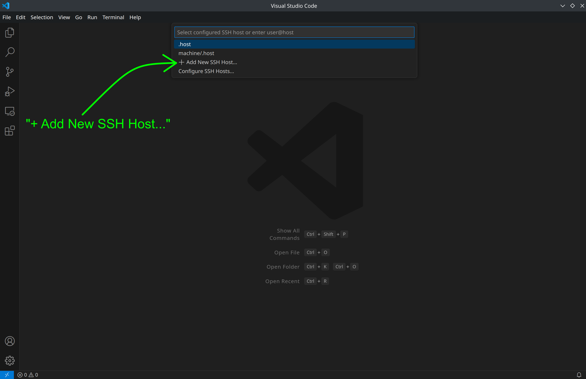

# SSH with Visual Studio Code
Connecting to a remote computer (such as your NB3's Raspberry Pi) via SSH using Visual Studio Code.

## Requirements
1. You are connected to the same network as your NB3
2. You have VS Code *and* the Remote-SSH extension installed

## Fist Connection
The first time you connect to your NB3, your computer will have no idea who this new computer is. It will therefore ask you to confirm that you do indeed want to connect and it will *store* some useful info about this connection.

- Select the Icon to "Open a Remote Window"


- A dialog window will appear, select "Connect to Host..."


- A new dialog will appear, select "+ Add New SSH Host"



- And yet another dialog will appear asking you to enter your SSH connection command. Enter the SSH command to connect your **USER** to your **NB3's IP Address**.

```txt
ssh <your-user-name-on-NB3>@<your-NB3's-IP-address>

# Example
ssh student@192.168.1.121
```


