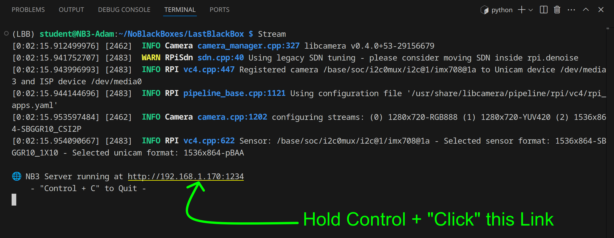

# Testing your NB3's Video
The following commands will test whether your NB3's Eye (camera) is working.

## Requirements
- Hardware installation of the NB3's eye.
- Open VS Code in the LBB repository folder
- Open a terminal window for entering commands

## Taking a picture (with Linux)
The following command should be entered into the (Linux) terminal window. It will record an image file (PNG) called "test.png" to the current working directory of the terminal.

```bash
# Capture a still image and save it to a file
libcamera-still -o test.png
```

You should see a new file created in the VS Code "file explorer". If you select this file, then you will be able to view it on your own computer.

## Streaming video
We have added a "shortcut" to your Linux installation that will run Python code to "stream" live images from your camera to a website *hosted by your NB3!*. Any device on the **same** network as your NB3 will be able to connect to this website and see what your robot is seeing.

```bash
# Run video streaming
Stream
# - Press Control+C to stop the streaming
```

When the command runs, you will see a link in the terminal with the URL of your NB3's streaming website. If you press "Control" + Click the link, then it will open it in the default web browser. You can also just type the link into the address bar.



The Python code that is run when you enter the "Stream" command is located [here](/boxes/vision/stream-NB3/stream.py).