# Crick : Electronics and Sensors
Day one of the NB3 build is entirely analog - no microcontroller, no software, no code. By the end of the session you will have built a working light sensor (LDR voltage divider), a hand-wound electromagnetic speaker, and a fully analog light-sensitive motor with a MOSFET as the only computational element.

<i>Materials</i>

Name|Description| # |Package|Data|Link|
:-------|:----------|:-----:|:-:|:--:|:--:|
Periodic Table|Periodic Table Card|1|Body (000)|[-D-](/boxes/atoms/card)|[-L-](VK)
NB3 Body|NB3 robot base PCB|1|Body (000)|[-D-](/boxes/electrons/NB3_body)|[-L-](VK)
Resistor (470)|470 &Omega;/0.25 W|2|Passive Electronics|[-D-](/boxes/electrons/_resources/datasheets/resistor.pdf)|[-L-](https://uk.farnell.com/multicomp/mf25-470r/res-470r-1-250mw-axial-metal-film/dp/9341943)
Resistor (1k)|1 k&Omega;/0.25 W|2|Passive Electronics|[-D-](/boxes/electrons/_resources/datasheets/resistor.pdf)|[-L-](https://uk.farnell.com/multicomp/mf25-1k/res-1k-1-250mw-axial-metal-film/dp/9341102)
Resistor (10k)|10 k&Omega;/0.25 W|2|Passive Electronics|[-D-](/boxes/electrons/_resources/datasheets/resistor.pdf)|[-L-](https://uk.farnell.com/multicomp/mf25-10k/res-10k-1-250mw-axial-metal-film/dp/9341110)
Button|Tactile switch|2|Passive Electronics|[-D-](/boxes/electrons/_resources/datasheets/button.pdf)|[-L-](https://uk.farnell.com/omron/b3f-1000/switch-spno-0-05a-24v-tht-0-98n/dp/176432)
Potentiometer|2.2 k&Omega; variable resistor|2|Passive Electronics|[-D-](/boxes/electrons/_resources/datasheets/pot_2k2.pdf)|[-L-](https://uk.farnell.com/bourns/3362p-1-222lf/trimmer-pot-2-2kohm-10-1turn-th/dp/2328599)
Breadboard (400)|400-tie solderless breadboard|1|Small (010)|[-D-](/boxes/electrons/_resources/datasheets/breadboard_400.pdf)|[-L-](https://www.amazon.co.uk/gp/product/B0739XRX8F)
Breadboards (170)|170-tie solderless breadboard|4|Small (010)|[-D-](/boxes/electrons/_resources/datasheets/breadboard_170.pdf)|[-L-](https://www.amazon.co.uk/ELEGOO-tie-points-Breadboard-Breadboards-Electronic/dp/B01N0YWIR7)
Batteries (AA)|AA 1.5 V alkaline battery|4|Auxiliary|[-D-](/boxes/electrons/)|[-L-](https://www.amazon.co.uk/Duracell-Optimum-Alkaline-Batteries-MX1500/dp/B093Q5XY66)
Battery holder|4xAA battery holder with ON-OFF switch|1|Small (010)|[-D-](/boxes/electrons/)|[-L-](https://www.amazon.co.uk/gp/product/B0814ZH68F)
Jumper Kit|Kit of multi-length 22 AWG breadboard jumpers|1|Large (100)|[-D-](/boxes/electrons/_resources/datasheets/jumper_kit.pdf)|[-L-](https://uk.farnell.com/multicomp/mc001810/hard-jumper-wire-22awg-140pc/dp/2770338)
Jumper Wires|Assorted 22 AWG jumper wire leads (male/female)|1|Cables (001)|[-D-](/boxes/electrons/_resources/datasheets/jumper_wires.pdf)|[-L-](https://www.amazon.co.uk/gp/product/B09KR7Z4PF)
Test Lead|Alligator clip to 0.64 mm pin (20 cm)|2|Cables (001)|[-D-](/boxes/electrons/)|[-L-](https://www.amazon.co.uk/gp/product/B096JR15JW)
Rubber feet|Adhesive rubber standoffs (1421T6CL)|4|Passive Electronics|[-D-](/boxes/electrons/_resources/datasheets/rubber_feet.pdf)|[-L-](https://uk.farnell.com/hammond/1421t6cl/feet-stick-on-pk24/dp/1876522)
Photoresistor (LDR)|Light-dependent resistor (GL5516 and GL5528)|2|Passive Electronics|[-D-](/boxes/sensors/)|[-L-](https://uk.farnell.com/advanced-photonix/nsl-19m51/light-dependent-resistor-550nm/dp/3168335)
DC Brushed Motor|6V Brushed DC motor|1|Large (100)|[-D-](/boxes/motors/)|[-L-](https://www.amazon.co.uk/Gikfun-1V-6V-Hobby-Arduino-EK1894/dp/B07BHHP2BT)
MOSFET (5V)|Power MOSFET/N-channel (IRL510)|1|Active Electronics|[-D-](/boxes/transistors/_resources/datasheets/IRL510.pdf)|[-L-](https://uk.farnell.com/vishay/irl510pbf/mosfet-n-logic-to-220/dp/9102779)
Diode|IN4001|2|Active Electronics|[-D-](/boxes/transistors/_resources/datasheets/IN4001.pdf)|[-L-](https://uk.farnell.com/on-semiconductor/1n4001g/diode-standard-1a-do-41/dp/1458986)
LED (Red)|3 mm/2 mA red LED|2|Active Electronics|[-D-](/boxes/transistors/_resources/datasheets/led_HLMP.pdf)|[-L-](https://uk.farnell.com/broadcom-limited/hlmp-1700/led-3mm-red-2-1mcd-626nm/dp/1003207)
LED (Yellow)|3 mm/2 mA yellow LED|2|Active Electronics|[-D-](/boxes/transistors/_resources/datasheets/led_HLMP.pdf)|[-L-](https://uk.farnell.com/broadcom-limited/hlmp-1719/led-3mm-yellow-2-1mcd-585nm/dp/1003208)
LED (Green)|3 mm/2 mA green LED|2|Active Electronics|[-D-](/boxes/transistors/_resources/datasheets/led_HLMP.pdf)|[-L-](https://uk.farnell.com/broadcom-limited/hlmp-1790/led-3mm-green-2-3mcd-569nm/dp/1003209)
Resistor (470)|470 &Omega;/0.25 W|4|Passive Electronics|[-D-](/boxes/electrons/_resources/datasheets/resistor.pdf)|[-L-](https://uk.farnell.com/multicomp/mf25-470r/res-470r-1-250mw-axial-metal-film/dp/9341943)
Magnet Wire|Narrow gauge epoxy insulated (1 m)|1|Passive Electronics|[-D-](/boxes/magnets/)|[-L-](https://www.amazon.co.uk/sourcing-map-Enameled-Transformers-Inductors/dp/B0CYP8L4L1)
Magnet|Neodymium disc (8 mm x 3 mm)|4|Auxiliary|[-D-](/boxes/magnets/)|[-L-](https://uk.farnell.com/duratool/d01766/magnets-rare-earth-8-x-3mm-pk10/dp/1888095)
USB Sound Card|USB to 3.5 mm Audio out/in|1|Auxiliary|[-D-](/boxes/magnets/)|[-L-](https://www.amazon.co.uk/UGREEN-USB-C-3-5mm-Female-Adapter-dp-B08TR7LWQH/dp/B08TR7LWQH)
Stereo Plug Terminal|3.5 mm plug to screw terminal|2|Auxiliary|[-D-](/boxes/magnets/)|[-L-](https://www.amazon.co.uk/dp/B07MNYBFL9)

## Atoms
#### Watch this video: [Atomic Structure](https://vimeo.com/1000458082)

> A brief introduction to the physics of atoms, their parts (protons, neutrons, and electrons), and their classical vs. quantum structure.

- **TASK**: Draw your favorite atom in the "classical" style
> You should have the appropriate number of electrons in each orbital.

#### Watch this video: [The Periodic Table](https://vimeo.com/1028399080)

> Organizing the elements into a table reveals a regular pattern, which is linked to the fundamental chemical properties of each material.

- When you need it *(and you will)*, then you can find a copy of the periodic table [here](/boxes/atoms/_resources/images/periodic_table.png).
- The electron configuration (assignments to specific orbitals) of each atomic element can be viewed [here](https://en.wikipedia.org/wiki/Electron_configurations_of_the_elements_(data_page)).

## Voltage, current, resistance
#### Watch this video: [Voltage](https://vimeo.com/1000730032)

<a href="https://vimeo.com/1000730032" title="Control+Click to watch in new tab">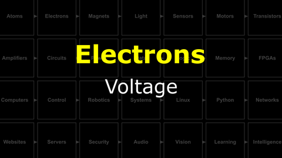</a>

> When there is more negative or positive charge in one location vs. another there is a *potential difference* between these locations. This *potential difference* is called a **voltage** and it creates a pressure that pushes electrons from the location with more negative charge to the location with less.

#### Watch this video: [Conductors](https://vimeo.com/1029337222)

<a href="https://vimeo.com/1029337222" title="Control+Click to watch in new tab">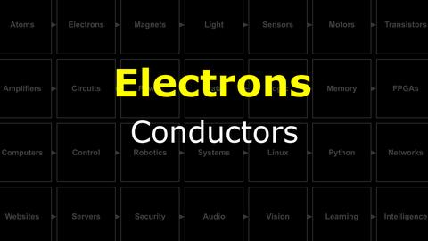</a>

> Some materials have electrons in their outer orbitals that are happy to jump between neighboring atomic nuclei (of the same element). These electrons are "free" to move around the material. If we place such a material between two locations with a *potential difference* (voltage), then electrons will flow from the **(-)** location to the **(+)** location; the material will **conduct** electricity.

#### Watch this video: [Batteries](https://vimeo.com/1029278169)

<a href="https://vimeo.com/1029278169" title="Control+Click to watch in new tab">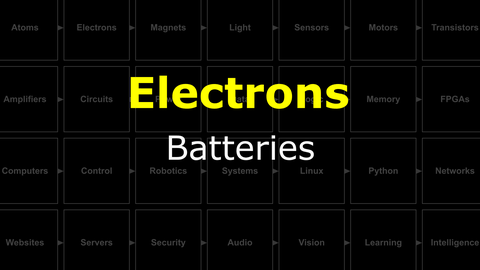</a>

> Generating a stable voltage requires a renewable source of electrons to maintain a *potential difference*. We can accomplish this with a (redox) chemical reaction inside the wonderfully useful device that we call a **battery**.

- **TASK**: Measure the voltage of a AA battery using your multimeter.
  - *Hint*: Select the voltage ("V") setting and touch your probes to either end of the battery. Depending on your multimeter, you may also need to select an appropriate "range". For a single AA battery, you should expect to measure between 1 and 2 Volts.
  - *Help*: If you are new to using a multimeter, then I recommend that you watch this video: [NB3-Multimeter Basics](https://vimeo.com/1027764019)
  - *Help*: If you are new to measuring voltage with a multimeter, then I recommend that you watch this video: [NB3-Measuring Voltage](https://vimeo.com/1027762531)
> A single AA battery, fully charged, should have a voltage of ~1.6 Volts. If it is less than 1.5 Volts, then the battery is nearly *dead*.
- **TASK**: Measure the voltage of 4xAA batteries in series (end to end).
  - *Hint*: You can use your battery holder.
> Batteries connected in series will sum their voltages. You should measure four times the voltage of a single AA battery, ~6.4 Volts, from the batteries in your 4xAA holder.

#### Watch this video: [Current](https://vimeo.com/1029334167/2492ff3542)

<a href="https://vimeo.com/1029334167/2492ff3542" title="Control+Click to watch in new tab">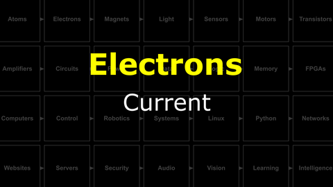</a>

> The rate at which electrons flow, measured as *#charges / second*, is called **current**. We use the unit *Amps* (A) and the circuit symbol **I**.

#### Watch this video: [Resistors](https://vimeo.com/1029696806)

<a href="https://vimeo.com/1029696806" title="Control+Click to watch in new tab">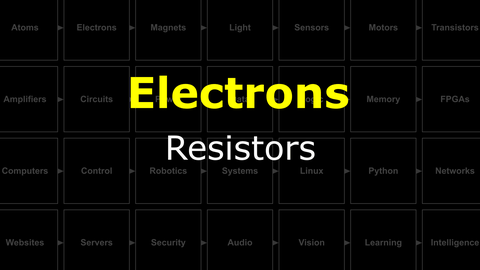</a>

> Many materials hold onto their outer electrons and resist their movement. We can create mixtures of these "resisting" materials and better "conducting" materials, often in the form of ceramics, to create **resistors** with a range of different *resistance* values, which we measure in Ohms (&Omega;).

- **TASK**: Measure the resistance of your resistors.
  - *Help*: If you are new to measuring resistance with a multimeter, then I recommend that you watch this video: [NB3-Measuring Resistance](https://vimeo.com/1027761453)
> Your kit contains 470 &Omega;, 1 k&Omega;, and 10 k&Omega; resistors. You should measure these values.

#### Watch this video: [Ohm's Law](https://vimeo.com/1029695302)

<a href="https://vimeo.com/1029695302" title="Control+Click to watch in new tab">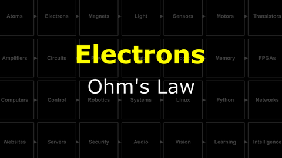</a>

> Ohm's Law describes the relationship between Voltage, Current, and Resistance. It is not complicated, but it is very useful.

- **TASK**: Does Ohm's Law hold? You know the voltage of the batteries (V) and the resistance of the resistor (R). Measure the current flowing (I) for different resistors and confirm that V = I*R.
> For the resistors in your kit, then Ohm's Law should determine the current that you measure.

#### Watch this video: [Power](https://vimeo.com/1029693122)

<a href="https://vimeo.com/1029693122" title="Control+Click to watch in new tab">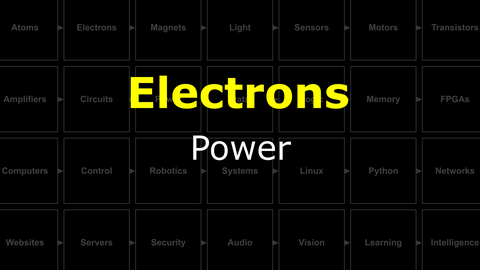</a>

> When electrons move through a circuit, they deliver power (some amount of energy in some amount of time). This power can be used to do useful things: make a motor move, light a lamp, or generate heat. If we deliver too little power, then our electronic device may not work as designed. If we deliver too much, then it may never work again. We measure power in Watts.

## Building circuits
#### Watch this video: [NB3 : Body](https://vimeo.com/1030776673)

<a href="https://vimeo.com/1030776673" title="Control+Click to watch in new tab">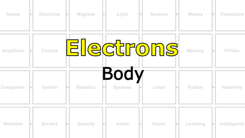</a>

> We will now start measuring and manipulating electricity, but first we will assemble a "prototyping platform" that also happens to be the **body** of your robot (NB3).

- **TASK**: Assemble the robot body (prototyping base board).
  - *Challenge*: If you are curious how the *NB3 Body* printed circuit board (PCB) was designed, then you can find the KiCAD files here: [NB3 Body PCB](/boxes/electrons/NB3_body).
> Your NB3 should now look like [this](/boxes/electrons/NB3_body/NB3_body_front.png). Your breadboards will be different colors...and you should have some rubber feet on the back.

#### Watch this video: [NB3 : Building Circuits](https://vimeo.com/1030783826)

<a href="https://vimeo.com/1030783826" title="Control+Click to watch in new tab">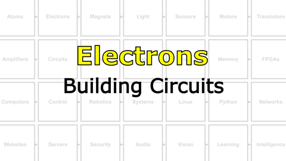</a>

> With a voltage source (battery) and resistors, then we can start building "circuits" - complete paths of conduction that allow current to flow from a location with *less* electrons **(+)** to a location with *more* electrons **(-)**.

- *Note*: This is *weird*. Electrons are the things moving. Shouldn't we say that current "flows" from the **(-)** area to the **(+)** area? Unfortunately, current was described before anyone knew about electrons and we are stuck with the following awkward convention: **Current is defined to flow from (+) to (-)**...even though we now know that electrons are moving the opposite direction.
- **TASK**: Build the simple circuit below and measure the current flowing when you connect the battery pack.
  - *Warning*: Measuring current with a multimeter is ***tricky***. You can only get an accurate measurement if ***ALL*** of the current in the circuit is forced to flow through your multimeter. This means that when measuring current, your multimeter must be in *series* with the rest of the circuit. (As opposed to measuring voltage, when your multimeter is placed "parallel" to the circuit.)
  - *Help*: If you are new to measuring current with a multimeter, then I recommend you watch this video: [NB3-Measuring Current](https://vimeo.com/1027757287).
> Not too much current...and do not break your multimeter.

## Voltage dividers and transduction
#### Watch this video: [Voltage Dividers](https://vimeo.com/1030787469)

<a href="https://vimeo.com/1030787469" title="Control+Click to watch in new tab">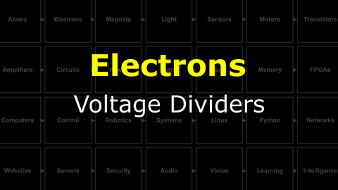</a>

> Controlling the level of voltage at different places in a circuit is critical to designing electronic devices.

- **TASK**: Build a voltage divider using two resistors of the same value. Measure the intermediate voltage (between the resistors).
> With equal size resistors, the intermediate voltage you measure should be half of the supply voltage.
- **TASK**: Build a voltage divider using a variable resistor (potentiometer). Measure the intermediate voltage. What happens when you change the position of the internal contact of the variable resistor (by turning the screw)?
  - *Help*: A video guide to completing these tasks can be found here: [NB3-Building Voltage Dividers](https://vimeo.com/1030790826)
> The intermediate voltage should vary continuously as you adjust the potentiometer.

#### Watch this video: [NB3 : Building Voltage Dividers](https://vimeo.com/1030790826)

<a href="https://vimeo.com/1030790826" title="Control+Click to watch in new tab">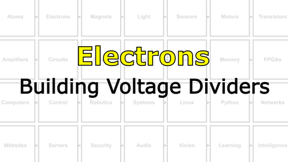</a>

> Step-by-step guide to building and testing voltage dividers with discrete resistors and a potentiometer.

#### Watch this video: [Transducers](https://vimeo.com/1031477896)

> A sensor converts (transduces) a physical quantity (light, heat, pressure, etc.) into an electrical signal (voltage, current, or resistance).

## Magnets
#### Watch this video: [Ferromagnetism](https://vimeo.com/1031272573)

<a href="https://vimeo.com/1031272573" title="Control+Click to watch in new tab">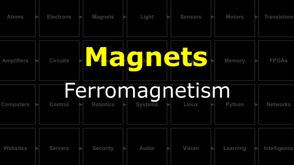</a>

> A mysterious force found in certain types of "magical" materials, ferromagnetism was known about and used for thousands of years, but it was only understood quite recently.

#### Watch this video: [Electromagnets](https://vimeo.com/1031275874)

<a href="https://vimeo.com/1031275874" title="Control+Click to watch in new tab">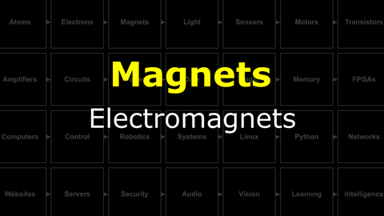</a>

> When electrons move they create a (weak) magnetic field. With clever geometry we can make this field much, much stronger.

## Motors
#### Watch this video: [DC Motors](https://vimeo.com/1031627739)

> An electric motor converts current into rotation using electromagnets that are turned on and off in a coordinated pattern. Different types of motors (stepper, brushed, or brushless) use different strategies (circuits) for this coordination.

- **TASK**: Play with your brushed DC motor. Spin it forwards *and* backwards...
    - *Challenge*: What are some ways you could change the *speed* with which your motor spins?
> Switching the direction that current flows through your motor will change the direction it spins.

## Semiconductors and the MOSFET
#### Watch this video: [Semiconductors](https://vimeo.com/1032460818)

<a href="https://vimeo.com/1032460818" title="Control+Click to watch in new tab">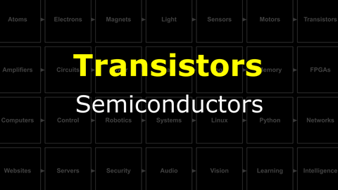</a>

> We can modify a pure crystal of certain elements (e.g. silicon) to change how well they conduct electricity.

#### Watch this video: [Diodes](https://vimeo.com/1032443724)

<a href="https://vimeo.com/1032443724" title="Control+Click to watch in new tab">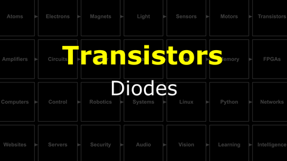</a>

> The chemical and electrical equilibrium between charge carriers creates a potential across the PN junction. This junction potential only permits current flow in one direction, which gives **diodes** there delightfully non-linear behavior.

- **TASK**: Illuminate a light-emitting diode (LED). *Remember the current limiting resistor!*
> The LED should only illuminate when installed in one orientation. If you flip it around, then the "diode" of the LED will prevent current flowing through the circuit.

#### Watch this video: [Transistors (MOSFETs)](https://vimeo.com/1032452466)

<a href="https://vimeo.com/1032452466" title="Control+Click to watch in new tab">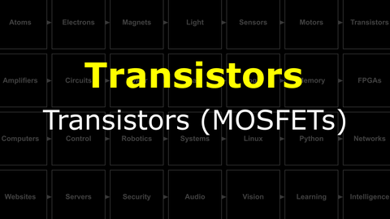</a>

> MOSFETs are the thing that humans have built more of than anything else. They must be useful! Let's discuss what they are and how they work.

- **TASK**: Measure the threshold voltage that opens your MOSFET gate. Compare it to the "expected" range listed in the
    - The datasheet for your MOSFET here [IRL510](/boxes/transistors/_resources/datasheets/IRL510.pdf)
> The threshold for when current starts to flow through your MOSFET ("Gate-Source Threshold Voltage") should be between 1 to 3 vols for the IRL510. However, the amount of current it allows will rise rapidly up to (and beyond) 5 Volts for the IRL510. Check the datasheet (Figure 3).

# Project
#### Watch this video: [NB3 : Building a Speaker](https://vimeo.com/1031277112)

<a href="https://vimeo.com/1031277112" title="Control+Click to watch in new tab">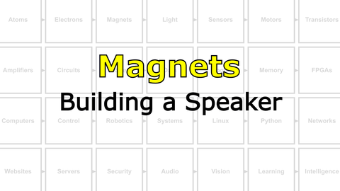</a>

> Oscillating current in a coil creates a dynamic magnetic field. Let's turn these oscillations into sound.

#### Watch this video: [NB3 : Building a Light Sensor](https://vimeo.com/1031479533)

<a href="https://vimeo.com/1031479533" title="Control+Click to watch in new tab">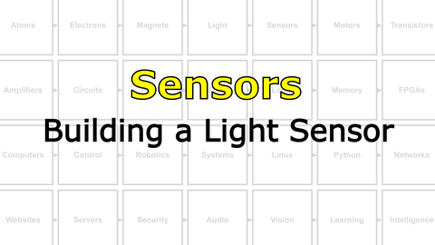</a>

> Your NB3 will use LDRs to convert light into voltage. Here you will build and test this light sensing circuit.

- **TASK**: Build a light sensor
    - *Hint*: Build a voltage divider with one of the fixed resistors replaced with an LDR (light-dependent resistor). Does the "output" voltage vary with light level?
    - *Challenge*: What should the value of the fixed resistor be to maximize the sensitive range of the output voltage for varying light levels?
> Your multimeter should measure a change in voltage as you cover your LDR or shine light on it. The voltage will either increase with more light or decrease, depending on whether your LDR is the first or second resistor in the voltage divider circuit.

#### Watch this video: [NB3 : Building a Light-Sensitive Motor](https://vimeo.com/1032454998)

<a href="https://vimeo.com/1032454998" title="Control+Click to watch in new tab">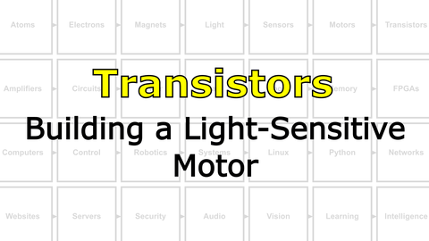</a>

> Let's make something move in response to light!

- **TASK**: Use a MOSFET transistor to control how much current is flowing through your motor and gate the MOSFET with the output voltage from your light sensor...creating a motor that spins when the light is **ON** and stops when the light is **OFF**, or the other way around.
- *Hint*: Use the following circuit as a guide: [MOSFET driver:400](/boxes/transistors/_resources/images/MOSFET_motor_driver.png)
> Your motor should change how fast it spins when you change how much light hits the LDR.

