# Crick : Arduino and Braitenberg
Day two: yesterday's analog brain becomes a programmable one. By the end of the day a Braitenberg vehicle drives itself based on what its two LDR eyes see.

<details><summary><i>Materials</i></summary><p>

Name|Description| # |Package|Data|Link|
:-------|:----------|:-----:|:-:|:--:|:--:|
Microcontroller|Arduino Nano (rev.3)|1|Medium (011)|[-D-](/boxes/computers/_resources/datasheets/arduino_nano_rev3.pdf)|[-L-](https://uk.farnell.com/arduino/a000005/arduino-nano-evaluation-board/dp/1848691)
Piezo Buzzer|Piezoelectric speaker/transducer|1|Passive Electronics|[-D-](/boxes/computers/_resources/datasheets/piezo_buzzer.pdf)|[-L-](https://uk.farnell.com/tdk/ps1240p02bt/piezoelectric-buzzer-4khz-70dba/dp/3267212)
Cable (MiniUSB-1m)|Mini-USB to Type-A cable (1 m)|1|Cables (001)|[-D-](/boxes/computers/)|[-L-](https://www.amazon.co.uk/gp/product/B07FWF2KBF)
Servo Motor|FT90R Digital Micro Continuous Rotation Servo|2|Large (100)|[-D-](/boxes/control/)|[-L-](https://www.pololu.com/product/2817)
Servo Wheel|Wheels (70x8mm) for servos|2|Large (100)|[-D-](/boxes/control/)|[-L-](https://www.pololu.com/product/4925)
Servo Mount|Mount for servo motor|2|Acrylic Mounts|[-D-](/boxes/robotics/)|[-L-](VK)
M2.5 bolt (6)|6 mm long M2.5 bolt|8|Mounting Hardware|[-D-](/boxes/robotics/)|[-L-](https://www.accu.co.uk/pozi-pan-head-screws/9255-SPP-M2-5-6-A2)
M2.5 standoff (12/SS)|12 mm long socket-to-socket M2.5 standoff|4|Mounting Hardware|[-D-](/boxes/robotics/)|[-L-](https://uk.farnell.com/wurth-elektronik/970120151/standoff-hex-female-female-12mm/dp/2884528)
Caster|0.75 inch metal ball caster|1|Large (100)|[-D-](/boxes/robotics/https://www.pololu.com/product/955)|[-L-](https://www.pololu.com/product/955)
Spacer|NB3 spacer 3 mm spacer for mounting ball caster|5|Acrylic Mounts|[-D-](/boxes/robotics/NB3_spacer)|[-L-](VK)

</p></details><hr>

## Computers
#### Watch this video: [Logic Gates](https://vimeo.com/1033231995)
<p align="center">
<a href="https://vimeo.com/1033231995" title="Control+Click to watch in new tab"></a>
</p>

> The essential elements of computation (NOT, AND, OR, XOR, etc.) can be built from straight forward combinations of MOSFETs.

- Design an XOR gate
- Build an addition circuit (2-bit adder)
- Build a priority encoder for your 2-bit ADC

#### Watch this video: [Flash Memory](https://vimeo.com/1033230293)
<p align="center">
<a href="https://vimeo.com/1033230293" title="Control+Click to watch in new tab"></a>
</p>

> Storing much of your data requires *quantum mechanics*.


#### Watch this video: [Architecture](https://vimeo.com/1033601146)
<p align="center">
<a href="https://vimeo.com/1033601146" title="Control+Click to watch in new tab">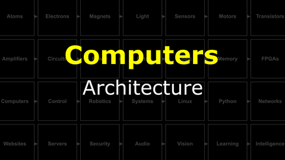</a>
</p>

> The basic building blocks of a computer (memory, ALU, clock, bus, and IO) have a standard arrangement (architecture) in modern systems.


#### Watch this video: [NB3 : Hindbrain](https://vimeo.com/1033609727)
<p align="center">
<a href="https://vimeo.com/1033609727" title="Control+Click to watch in new tab">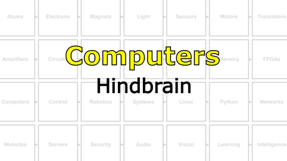</a>
</p>

> We will now add a *computer* to our robot. We be using a simple microcontroller as our NB3's hindbrain. It will be responsible for controlling the "muscles" (motors) in response to commands from another (larger) computer that we will be adding later to the NB3's midbrain.

**TASK**: Mount and power your Arduino-based hindbrain (connect the mini-USB cable)
> The built-in LED on the board should be blinking at 1 Hz.
**TASK**: Download and install the Arduino IDE (integrated development environment).
  - Follow the instructions for your "host" computer's operating system here: [Arduino IDE](https://www.arduino.cc/en/software)
  - Open the "Blink" Example: File -> Examples -> Basic -> Blink
  - Upload this example to your board
  - ***IMPORTANT***: If you have trouble connecting to the Arduino from your Laptop, then it may be necessary to install the "latest" driver from FTDI for the chip that communicates over the USB cable. This is not always necessary, so please try the normal installation first. However, if you are stuck, then please checkout these [FTDI driver installation instructions](https://support.arduino.cc/hc/en-us/articles/4411305694610-Install-or-update-FTDI-drivers).
> You should be able to successfully compile and upload the "Blink" example (with no errors).

## Programming the Arduino
#### Watch this video: [NB3 : Programming Arduino](https://vimeo.com/1033810807)
<p align="center">
<a href="https://vimeo.com/1033810807" title="Control+Click to watch in new tab">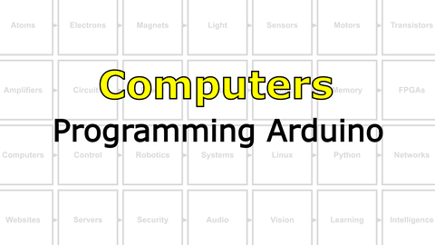</a>
</p>

> An introduction to programming an Arduino microcontroller.

- You will now write programs that interact with the input and output pins of your Arduino. This "pin diagram" will help you find the correct locations. ***The Arduino on your NB3 is mounted "upside down" relative to this diagram...adjust accordingly!***
<p align="center">

</p>

**TASK**: Blink an *internal* LED
  - Change the following example code (the classic "[Blinky](/boxes/computers/arduino/ide/blink/blink.ino)" example) to make the internal LED blink at a different frequency.
```c
/*
  Blink

  Turns an LED on for one second, then off for one second, forever.

  Most Arduinos have an on-board LED that you can control. On the NANO
  (your NB3's Hindbrain) it is attached to pin 13.
*/

// The setup function runs once after you press reset or power up the board
void setup() {
  // Initialize digital pin 13 (the LED) as an output.
  pinMode(13, OUTPUT);
}

// The loop function runs over and over again...forever
void loop() {
  digitalWrite(13, HIGH);   // Turn the LED on (set to the HIGH voltage level)
  delay(1000);              // Wait for a second
  digitalWrite(13, LOW);    // Turn the LED off (set to the LOW voltage level)
  delay(1000);              // Wait for a second
}
```
> Your internal LED should now be blinking faster or slower than 1 Hz (once per second).
**TASK**: Blink an *external* LED
  - *Hint*: Connect one of your LEDs to digital pin 13, but don't forget your current limiting resistor!
<p align="center">
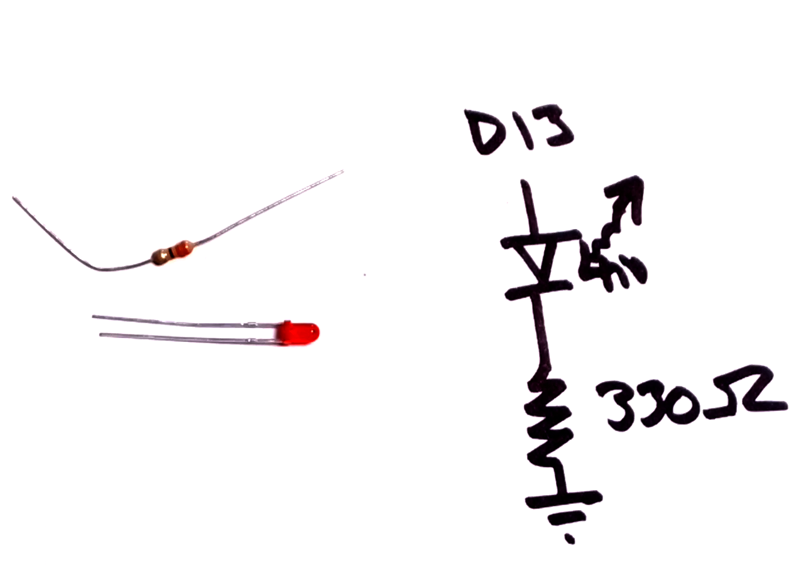
</p>

> Your external LED should now be blinking at the same time as the built-in LED (if both are connected to pin 13).
**TASK**: Generate a *pulsing* signal for your piezo buzzer
  - This is a piezo buzzer:
<p align="center">
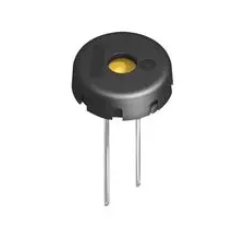
</p>

  - The piezo buzzer will expand and contract as you switch the voltage applied across it from 0V to 5V. This expansion and contraction forces air into and out of the plastic case. If you switch it ON/OFF fast enough, then you can *hear it*!
  - Connect one leg of the piezo to pin 11 and the other to Ground.
  - *Note:*: You could use the "Blink" example to toggle pin 11 with a much shorter delay between the ON/OFF "blinks". However, it is much easier to use a function called "tone()" that will allow you to generate pulses at very specific frequencies.
  - Upload this [code](/boxes/computers/arduino/ide/tone/tone.ino) to your Arduino (just the paste the following into a new sketch on your IDE and "upload").
```c
/*
  Tone
   - Generate a tone (square wave pulses at a specific frequency) on one of
     Arduino's digital pins
   -- You can use any of the Arduino pins that have "~" symbol on the pinout
      diagram. This example uses pin 11 (PIEZO_PIN)
*/

// List constant values that you can use throughout the program
const int PIEZO_PIN = 11;       // Buzzer Pin (must have ~ for PWM)

// The setup function runs once after you press reset or power up the board
void setup() {
  // Initialize digital pin PIEZO_PIN as an output.
  pinMode(PIEZO_PIN, OUTPUT);
}

// The loop function runs over and over again...forever
void loop() {
  // Generate Sound Output at 2000 Hz (2 kHz) for 1000 ms (1 second)
  tone(PIEZO_PIN, 2000, 1000);

  // Wait 1500 ms for the tone to finish
  // - The tone will play for 1000 ms and then silence for 500 ms
  delay(1500);

  // Generate Sound Output at 1700 Hz (1.7 kHz) for 1000 ms (1 second)
  tone(PIEZO_PIN, 1700, 1000);

  // Wait 1500 ms for the tone to finish
  // - The tone will play for 1000 ms and then silence for 500 ms
  delay(1500);
}
```
  - **Challenge**: Try to add some more notes and play a recognizable melody!
> You should here a (somewhat unpleasant) sound from the piezo buzzer
**TASK**: Measure an **analog** signal from your LDR light sensor circuit and send the measured values to your host computer via the USB (serial) connection.
  - *Hint*: Connect the output voltage of your light sensor (the "middle" of the divider) to an analog input pin (the example below uses pin A0).
  - *Note*: In order to see what values are measured, the following program sends the analog values as text characters over the USB serial connection to your laptop. Your can watch these values arrive by opening the Arduino IDE's "Serial Monitor" (an icon in the upper-right corner of the main window).
  - Upload this [code](/boxes/computers/arduino/ide/tone/tone.ino) to your Arduino.
```c
/*
  Analog
  - Reads an analog voltage on pin A0
  - Sends the measured value to the USB serial port.
*/

// The setup function runs once after you press reset or power up the board
void setup() {
  // Initialize serial communication at 9600 bits per second
  Serial.begin(9600);
}

// The loop function runs over and over again...forever
void loop() {
  // Read the input on analog pin A0
  int value = analogRead(A0);

  // Send (print) the value on the serial port
  Serial.println(value);
  delay(1); // Wait briefly (1 ms) between reads for stability
}
```
  - *Challenge*: Write a program that will turn on your LED when the light signal is above (or below) some threshold value.
> You should see values on your host laptop and they should change along with changing light levels.

#### Watch this video: [Binary Numbers](https://vimeo.com/1033226788)
<p align="center">
<a href="https://vimeo.com/1033226788" title="Control+Click to watch in new tab"></a>
</p>

> All you need is 0 and 1. Here we will learn how to represent *anything* in binary.

- Write your name in binary (using the ASCII table) in either Hex or Decimal notation.

#### Watch this video: [Analog to Digital Converters](https://vimeo.com/1033223967)
<p align="center">
<a href="https://vimeo.com/1033223967" title="Control+Click to watch in new tab"></a>
</p>

> Moving signals from the analog world to the digital world requires converting a continuous voltage into discrete binary values. We can accomplish this with an analog to digital converter, or **ADC**, and here we learn how they work.

- Build the input stage for a 2-bit ADC using the LM339/LM2901 comparator and a resistor ladder.

#### Watch this video: [NB3 : Building a Theremin](https://vimeo.com/1033896646)
<p align="center">
<a href="https://vimeo.com/1033896646" title="Control+Click to watch in new tab">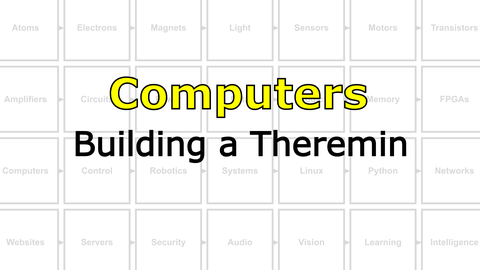</a>
</p>

> Building a light-to-sound feedback loop musical instrument (theremin) using an Arduino, an LDR, and a Piezo buzzer.

- **TASK**: Build a Theremin
- *Hint*: What if you used the analog voltage signal measured from your light sensor to change the frequency of the "tone" playing on your buzzer? Hmm...
> You should here a sound that varies with your hand motion (in front of a light)
- **TASK**: ***Have fun!*** (Make something cool)
<p align="center">

</p>

> You should have fun!

## Motor control
#### Watch this video: [PWM](https://vimeo.com/1033905955)
<p align="center">
<a href="https://vimeo.com/1033905955" title="Control+Click to watch in new tab">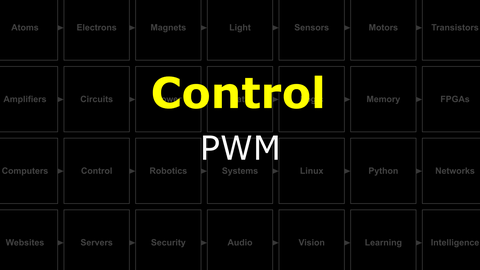</a>
</p>

> We can control a "continuous" range of outputs with a binary digital signal (only 0s and 1s) by switching the output **ON** and **OFF** very quickly. Our "continuous" output is then the average of the percentage of time spent **ON** vs **OFF**. We cal this percentage the "duty cycle", and we call this output control method *pulse width modulation* or **PWM**.


#### Watch this video: [Servo Loops](https://vimeo.com/1033963709)
<p align="center">
<a href="https://vimeo.com/1033963709" title="Control+Click to watch in new tab">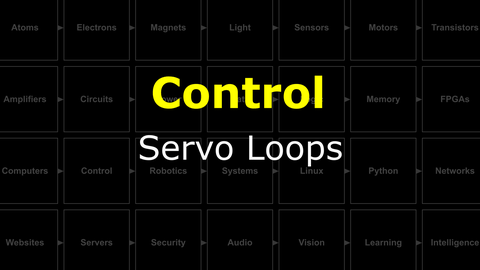</a>
</p>

> A servo loop connects feedback from a sensor to the control signals sent to a motor.


#### Watch this video: [NB3 : Muscles (Servos)](https://vimeo.com/1034800702)
<p align="center">
<a href="https://vimeo.com/1034800702" title="Control+Click to watch in new tab">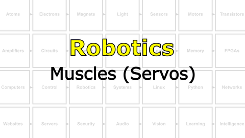</a>
</p>

> Let's build your robot's movement system (using servo motors).

- **TASK**: Mount the servo motors and wheels to your NB3.
> The mounted servo motors should look like this.
- In order to control your servo motors, you must send a square wave signal from your NB3's hindbrain with very specific timing. The details of this control signal's timing are described in the comments of the example code here: [Servo Test (Arduino)](/boxes/robotics/programming/arduino/muscles_test_servo/muscles_test_servo.ino).
- This servo test code uses a library, called "servo", to make it easier to control your NB3's muscles.
- *code*
```c
#include <Servo.h>  // This includes the "servo" library

Servo left, right;  // This creates two servo objects, one for each motor

int speed = 0;      // This creates a variable called "speed" that is initially set to 0

// Setup
void setup() {
  right.attach(9);  // Assign right servo to digital (PWM) pin 9 (change according to your connection)
  left.attach(10);  // Assign left servo to digital (PWM) pin 10 (change according to your connection)
}

void loop() {

  // Servos are often used to control "angle" of the motor, therefore the "servo library" uses a range of 0 to 180.
  // Your servos control "speed", therefore 0 is full speed clockwise, 90 is stopped, and 180 is full speed counter-clockwise

  // Move left servo through the full range of speeds
  for (speed = 0; speed <= 180; speed += 1) {
    left.write(speed);
    delay(15);
  }
  left.write(90); // stop left servo

  // Move right servo
  for (speed = 0; speed <= 180; speed += 1) {
    right.write(speed);
    delay(15);
  }
  right.write(90); // stop right servo
}
```
- **TASK**: Test your servo motors by sending control commands from your NB3's hindbrain.
> One servo motor should spin forwards and backwards, then the other...and then repeat.

#### Watch this video: [NB3 : Ball Caster](https://vimeo.com/1034797327)
<p align="center">
<a href="https://vimeo.com/1034797327" title="Control+Click to watch in new tab">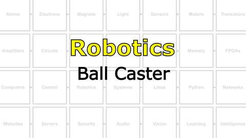</a>
</p>

> Let's add a front wheel (ball caster) to keep your NB3 from dragging its face on the ground.

- **TASK**: Mount caster (ball bearing) to the front of your NB3.
> The ball caster mount should look like this.

# Project
#### Watch this video: [NB3 : Build a Braitenberg Vehicle](https://vimeo.com/1034798460)
<p align="center">
<a href="https://vimeo.com/1034798460" title="Control+Click to watch in new tab">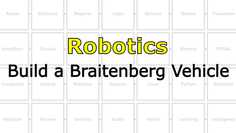</a>
</p>

> Here we create the first Braitenberg Vehicle, a simple sensory-motor feedback loop connecting two light sensors to the motion of two wheels.

- A Braitenberg Vehicle can show complex behaviour, appearing to seek out light and avoid shadows, but the underlying control circuit is extremely simple.
<p align="center">
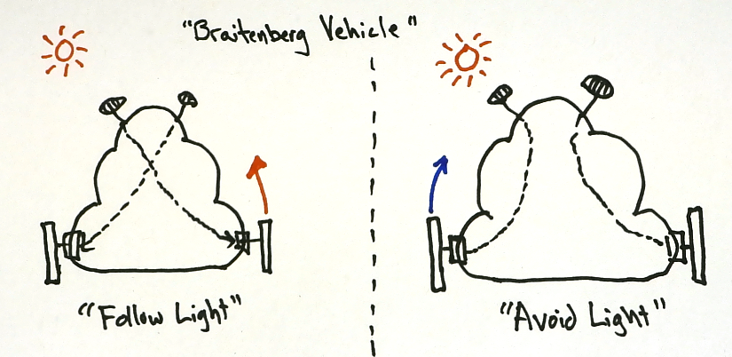
</p>

- A small change to the control circuit can completely change how your NB£ "vehicle" responds to light.
- **TASK**: Measure two light sensors and *decide* how to activate the direction of your two wheels in response.
- Some example code to get you started can be found here: [Braitenberg Vehicle (Arduino)](/boxes/robotics/programming/arduino/braitenberg_vehicle/braitenberg_vehicle.ino)
> You should have created a robot that either likes (turns toward) or avoids (turns away from) light.

