# Crick : Web Stack and Senses
Day four: the robot becomes a network device with a browser interface, then gets eyes, ears, and a mouth. By the end of the day you can drive it from your phone while watching its live camera feed.

<details><summary><i>Materials</i></summary><p>

Name|Description| # |Package|Data|Link|
:-------|:----------|:-----:|:-:|:--:|:--:|
Cable (MiniUSB-20cm)|Short mini-USB to Type-A cable (20 cm)|1|Cables (001)|[-D-](/boxes/networks/)|[-L-](https://www.amazon.co.uk/gp/product/B07FW69HNT)
NB3 Ear|I2S mems microphone breakout board|2|Circuit Boards|[-D-](/boxes/audio/NB3_ear)|[-L-](VK)
NB3 Mouth|I2S DAC-AMP breakout board|1|Circuit Boards|[-D-](/boxes/audio/NB3_mouth)|[-L-](VK)
Speaker (Hi-Fi)|3 Watt 4 Ohm with Dupont 2.54 mm socket (High Fidelity: 2831/3128)|1|Large (100)|[-D-](/boxes/audio/_resources/datasheets/3128_3W_4Ohm.jpg)|[-L-](https://www.amazon.co.uk/gp/product/B0D9QXW5FF)
Speaker Mount|Custom laser cut mount for speaker|1|Acrylic Mounts|[-D-](/boxes/audio/-)|[-L-](VK)
Speaker Frame|Custom laser cut frame for speaker|1|Acrylic Mounts|[-D-](/boxes/audio/-)|[-L-](VK)
M3 standoff (15/PS)|15 mm long plug-to-socket M3 standoff|2|Mounting Hardware|[-D-](/boxes/audio/-)|[-L-](https://uk.farnell.com/ettinger/05-13-151/spacer-m3x15-vzk/dp/1466726)
M3 nut (square)|square M3 nut 1.8 mm thick|2|Mounting Hardware|[-D-](/boxes/audio/-)|[-L-](https://www.accu.co.uk/flat-square-nuts/21326-HFSN-M3-A2)
M3 bolt (6)|6 mm long M3 bolt|2|Mounting Hardware|[-D-](/boxes/audio/-)|[-L-](https://www.accu.co.uk/pozi-pan-head-screws/500113-SPP-M3-6-ST-BZP)
M2.5 bolt (6)|6 mm long M2.5 bolt|2|Mounting Hardware|[-D-](/boxes/robotics/)|[-L-](https://www.accu.co.uk/pozi-pan-head-screws/9255-SPP-M2-5-6-A2)
M2.5 nut|regular M2.5 nut|2|Mounting Hardware|[-D-](/boxes/power/-)|[-L-](https://www.accu.co.uk/hexagon-nuts/456430-HPN-M2-5-C8-Z)
M2 bolt (8)|8 mm long M2 bolt|2|Mounting Hardware|[-D-](/boxes/audio/)|[-L-](https://www.accu.co.uk/pozi-pan-head-screws/500101-SPP-M2-8-ST-BZP)
M2 nut|regular M2 nut|2|Mounting Hardware|[-D-](/boxes/audio/)|[-L-](https://www.accu.co.uk/hexagon-nuts/456429-HPN-M2-C8-Z)
Camera (RPi v3)|RPi color camera with auto-focus (version 3)|1|Medium (011)|[-D-](/boxes/vision/_resources/datasheets/rpi_camera_v3.pdf)|[-L-](https://uk.farnell.com/raspberry-pi/sc0872/rpi-camera-mod-3-standard-lens/dp/4132318)
NB3 Camera Mount|Custom laser cut mount for RPi camera|1|Acrylic Mounts|[-D-](/boxes/vision/NB3_camera_mount)|[-L-](VK)
NB3 Cortex Mount|Custom laser cut holder for NPU|1|Acrylic Mounts|[-D-](/boxes/vision/NB3_cortex_mount)|[-L-](VK)
M2.5 bolt (6)|6 mm long M2.5 bolt|4|Mounting Hardware|[-D-](/boxes/robotics/)|[-L-](https://www.accu.co.uk/pozi-pan-head-screws/9255-SPP-M2-5-6-A2)
M2.5 standoff (20/PS)|20 mm long plug-to-socket M2.5 standoff|4|Mounting Hardware|[-D-](/boxes/vision/)|[-L-](https://uk.farnell.com/wurth-elektronik/971200151/standoff-hex-male-female-20mm/dp/2884418)
M3 nut (square)|square M3 nut 1.8 mm thick|1|Mounting Hardware|[-D-](/boxes/audio/-)|[-L-](https://www.accu.co.uk/flat-square-nuts/21326-HFSN-M3-A2)
M3 bolt (12)|12 mm long M3 bolt|1|Mounting Hardware|[-D-](/boxes/vision/)|[-L-](https://www.accu.co.uk/pozi-pan-head-screws/500116-SPP-M3-12-ST-BZP)
M2 bolt (8)|8 mm long M2 bolt|4|Mounting Hardware|[-D-](/boxes/audio/)|[-L-](https://www.accu.co.uk/pozi-pan-head-screws/500101-SPP-M2-8-ST-BZP)
M2 nut|regular M2 nut|4|Mounting Hardware|[-D-](/boxes/audio/)|[-L-](https://www.accu.co.uk/hexagon-nuts/456429-HPN-M2-C8-Z)

</p></details><hr>

## Networks and HTTP
#### Watch this video: [Sockets](https://vimeo.com/1134201413)
<p align="center">
<a href="https://vimeo.com/1134201413" title="Control+Click to watch in new tab">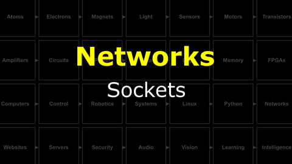</a>
</p>

> Sockets abstract the idea of a connection between computers. A socket communicates to another socket using either TCP or UDP packets. It has an address. It can listen for and request connections.

- Load some new code onto your Arduino that streams the analog voltage values measured at pin A0 (scaled 0 to 255) over the serial connection to your RPi. Feel free to connect something interesting, like a light sensor, to the AO input. Here is some example Arduino code: [Analog Stream](/boxes/networks/sockets/arduino/analog_stream/analog_stream.ino)
- Run the "socket server" Python example on your NB3's RPi. [Socket Server](/boxes/networks/sockets/python/server/socket_server.py)
  - This code waits for a "client" to connect and then starts sending the serial data received from Arduino over to the connected socket. The data is sent in small chunks (buffers), default size is 16 bytes...but you can change this in the code and see what happens to the streaming latency/performance.
- Run the "socket client" Python example on your PC (you will need a new VS Code window). [Socket Client](/boxes/networks/sockets/python/client/socket_client.py)
  - This code will form a connection to the "socket server" running on your NB3 and receive the data it sends. It prints the data received to the terminal.
  - If you prefer a cool "real-time plot", then you can use this (very simplistic) plotting library (NB3.Plot) to open a window on your PC and view a simple line plot of the data received from the socket. [Socket Client Pyglet Plot](/boxes/networks/sockets/python/client/socket_client_pyglet.py)
    - Note: This plotting code uses the Python "pyglet" library, a very nice wrapper of OpenGL (graphics library). It gives you *a lot* of control of the graphics processing on your PC and can produce some beautiful, fast visualizations of real-time data (and can even be used to make games!). We encourage you to explore and have fun!

#### Watch this video: [Architectures](https://vimeo.com/manage/videos/1127222969)
<p align="center">
<a href="https://vimeo.com/manage/videos/1127222969" title="Control+Click to watch in new tab">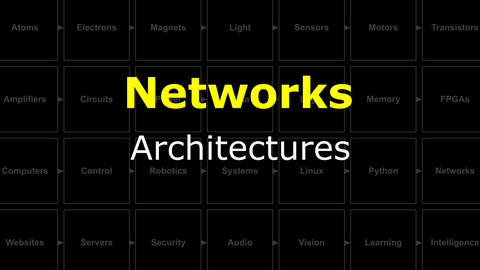</a>
</p>

> The arrangement of connections between computers (nodes) defines the network's *architecture*. These can be simple 1-to-1 connections or much more complex. Here we will introduce the architecture of our most important network, **the internet**.


#### Watch this video: [HTTP](https://vimeo.com/1135853103)
<p align="center">
<a href="https://vimeo.com/1135853103" title="Control+Click to watch in new tab">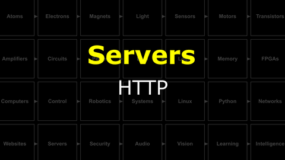</a>
</p>

> The fundamental "application protocol" of the internet is HTTP (Hyper Text Transfer Protocol). Your web browser (the client) uses HTTP to *request* HTML files (and other resources) from a computer that understands HTTP (the server) anywhere on the internet. Here we will build a *very simple* HTTP server in Python.

- The code for the "simplest" HTTP socket server is [here](/boxes/servers/python/simple_http_server/simplest_http_server.py)
  - Run this code and confirm that it is only able to serve a single file [index.html](/boxes/servers/python/simple_http_server/index.html)
- The code for a "simple" HTTP socket server (capable of serving other HTML files) is [here](/boxes/servers/python/simple_http_server/simple_http_server.py)
  - Run this code and confirm that the "link" to another HTML file works correctly.
- **BONUS**: Try connecting to the simple HTTP server running on your NB3 from the web browser on your phone (you must be on the same local network, e.g. same WiFi)

## The web stack
#### Watch this video: [HTML](https://vimeo.com/1134724080)
<p align="center">
<a href="https://vimeo.com/1134724080" title="Control+Click to watch in new tab">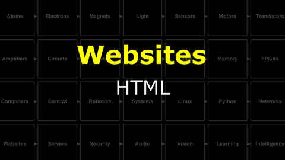</a>
</p>

> Hyper-text markup language (HTML) is the data format of the world-wide-web. When you "visit a website" you are simply asking for an HTML file. What is an HTML file? It is just a text file with some special "<tags>" that control how the contents of the file should be displayed. The program you use to request these and display these files is called a *web browser*.

- Create an HTML file. You can start from the simple template here: [HTML (simple)](/boxes/websites/html/simple.html)
  - You should do this on your PC (not NB3) in a VS Code window (or any text editor)
- Open your HTML file in a browser on your PC. Do you see your awesome website?
- Add some more complex layout to your website. Here is an example: [HTML (layout)](/boxes/websites/html/layout.html)
- Find a cool website on the internet. Use the developer tools in your internet browser to "explore" the mess of HTML that underlies this website...and maybe make some creative changes.

#### Watch this video: [CSS](https://vimeo.com/1134720724)
<p align="center">
<a href="https://vimeo.com/1134720724" title="Control+Click to watch in new tab">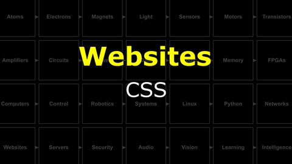</a>
</p>

> Webpages often have a consistent "style" across an entire website. It is possible to create and maintain this style by directly including the same style tags (colors, fonts, margins, etc.) in every HTML page, but this is difficult to maintain and tedious to update. Cascading Style Sheets (CSS) allow you to put all of your "styling" into a single file that can be included on the pages that need it, giving you one place to make tweaks to the styling of your entire website.

- Create a "styles.css" for your website. Add a link to this "stylesheet" in your HTML code. You can start with the examples (HTML and CSS) here: [CSS Examples](/boxes/websites/css/)
- Make your site look cool, and *consistent* across different pages.

#### Watch this video: [Javascript](https://vimeo.com/1134729863)
<p align="center">
<a href="https://vimeo.com/1134729863" title="Control+Click to watch in new tab">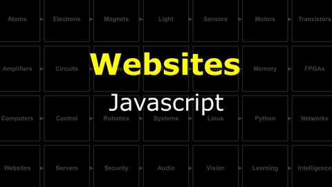</a>
</p>

> Javascript is the web browser's programming (scripting) language. It has very little to do with Java, but it is the main way to add "interaction" to websites. Everyone should know a little bit of Javascript. Also, given that everyone has access to a web browser, it is one of the easiest programming environments to setup and start playing around.

- Add some (Javascript) code to your website to make it more interactive.
- Here is an example to respond to a "button press" by hiding/revealing the navigation bar in a simple website: [Button Response](/boxes/websites/javascript/alternates/toggle.js)
- Here is another example to gets the current time and updates a live clock page: [Live Clock](/boxes/websites/javascript/alternates/clock.js)
- There is way more you can do with Javascript. Have fun exploring and learning!

#### Watch this video: [NB3 : Host a Website](https://vimeo.com/1135859914)
<p align="center">
<a href="https://vimeo.com/1135859914" title="Control+Click to watch in new tab">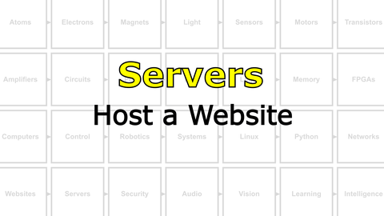</a>
</p>

> Let's host a website on your robot using the NB3 Server library and Python. We will first explain how the NB3 (HTTP) Server class works, what it is capable of, and then host a site with a range of different file types: HTML, CSS, images, icons, and Javascript.

- Explore the Python code for the [NB3 Server class](/libs/NB3/Server/server.py).
- Run the [NB3 Server Test](/boxes/servers/python/NB3_server_example/test_NB3_server.py) Python code on your robot.
  - The website resources "served" by this example are [here](/boxes/servers/python/NB3_server_example/site/).
- **TASK**: Challenge the NB3 Server's multi-threading.
  - While the server is running on your NB3, try connecting to it with multiple different web browsers (your PC, phone, tablet, etc.). This will test the "multi-threaded" handling of multiple simultaneous connections.
  - **BONUS**: Look up DDOS (Distributed Denial-of-Service) attacks. Can you use this approach to find the limits of the NB3 Server?
> The server should respond appropriately and each device should receive the same website. If it doesn't...please let us know!

## Ears and mouth
#### Watch this video: [Microphones, Speakers, and I2S](https://vimeo.com/1136576333)
<p align="center">
<a href="https://vimeo.com/1136576333" title="Control+Click to watch in new tab">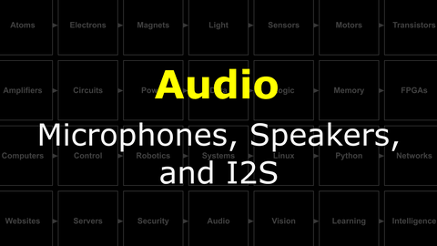</a>
</p>

> Here we introduce the NB3's audio system: MEMs-based stereo microphones (Ears), a Class D digital amplifier connected to a "Hi-Fi" speaker (Mouth), and a sound communication standard called I2S (Inter-integrated Circuit Sound) that the Raspberry Pi will use to talk to these audio devices.


#### Watch this video: [NB3 : Build and Install the Linux I2S Driver](https://vimeo.com/1042781850)
<p align="center">
<a href="https://vimeo.com/1042781850" title="Control+Click to watch in new tab">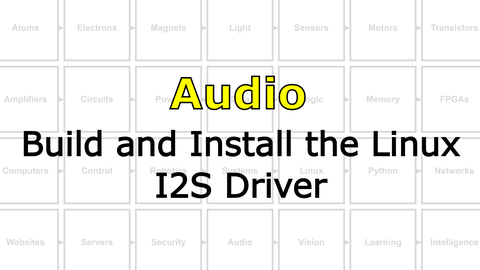</a>
</p>

> Let's build (compile) and install the Linux device driver for our NB3's sound card. This software module is required to access the NB3's ears (microphone) and mouth (speaker).


#### Watch this video: [NB3 : Install the Ears](https://vimeo.com/1042943195)
<p align="center">
<a href="https://vimeo.com/1042943195" title="Control+Click to watch in new tab">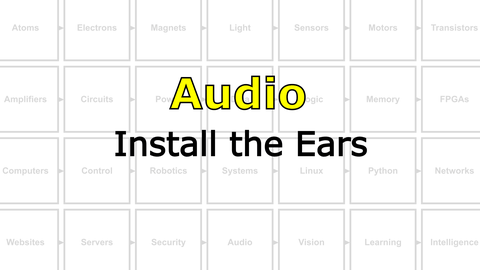</a>
</p>

> Let's add some ears to your NB3.


#### Watch this video: [NB3 : Install the Mouth](https://vimeo.com/1042947561)
<p align="center">
<a href="https://vimeo.com/1042947561" title="Control+Click to watch in new tab">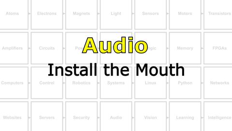</a>
</p>

> Let's add a mouth to your NB3.


## Eye
#### Watch this video: [Light, Cameras, Noise](https://vimeo.com/manage/videos/1141367902)
<p align="center">
<a href="https://vimeo.com/manage/videos/1141367902" title="Control+Click to watch in new tab">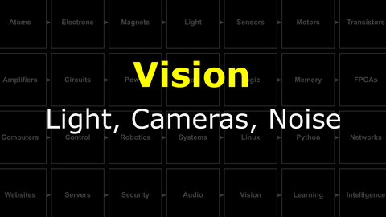</a>
</p>

> We start with a recap about light, measuring analog signals with computers, and then describe how a modern camera sensor is built. We then introduce the NB3's Eye and conclude with a discussion of the sources of noise that all cameras encounter when trying to *image* the real world.


#### Watch this video: [NB3 : Install the Eye](https://vimeo.com/1042945461)
<p align="center">
<a href="https://vimeo.com/1042945461" title="Control+Click to watch in new tab">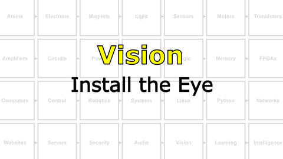</a>
</p>

> Let's install a camera on your NB3.

- Test your camera with the following command
```bash
# Capture a still image and save it to a file
rpicam-still -o my_test.png

# The image will appear in the same folder where the command was run
```

# Project
#### Watch this video: [NB3 : Remote Control NB3 (GUI)](https://vimeo.com/1135870296)
<p align="center">
<a href="https://vimeo.com/1135870296" title="Control+Click to watch in new tab">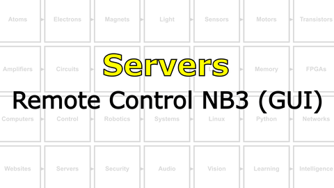</a>
</p>

> Let's remotely control your NB3 using a graphical user interface (GUI) that you can access from *any* web browser.

- **GOAL**: Host a website on your NB3 that has interactive buttons that you click (or touch on a touchscreen). Each button will generate different motions of your robot (forward, backward, left, right, etc.).
- This is a ***creative*** task with lots of different solutions. However, to get you started, we have created the example code described below.
- Upload the [serial controller](/boxes/networks/remote-NB3/arduino/serial_controller/serial_controller.ino) code to your **Arduino** hindbrain.
  - *Optional*: Expand your hindbrain command repertoire to include LED blinks, buzzes...the choice is yours.
- Host a website with interactive buttons by running the [Remote Control GUI](/boxes/servers/python/remote-NB3_GUI/remote_control_GUI.py) server code on your NB3.
  - The website's HTML, CSS, and Javascript is [here](/boxes/servers/python/remote-NB3_GUI/site/).
- **TASK**: Add a behaviour for the "Do Action" button.
  - This can be a simple sequence of movements (using commands already understood by your hindbrain), or you can create an entirely new behaviour for either your hindbrain or midbrain to execute.
> Your "Action" button" (?) should now do something cool!

#### Watch this video: [NB3 : Streaming Images](https://vimeo.com/manage/videos/1141582696)
<p align="center">
<a href="https://vimeo.com/manage/videos/1141582696" title="Control+Click to watch in new tab">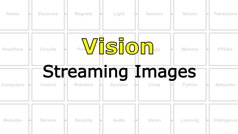</a>
</p>

> Let's stream live images from your NB3's camera to any web browser.


