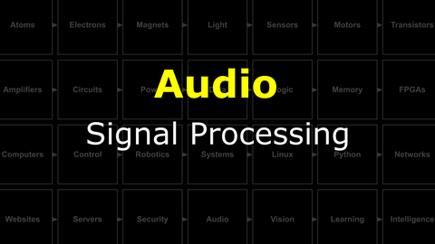
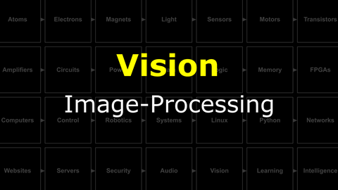

# Crick : Open Projects
Day five: you have a full-stack robot. Today is about using it. Pick a track in the morning, scope a project, build and demo by 16:30.

<details><summary><i>Materials</i></summary><p>

Name|Description| # |Package|Data|Link|
:-------|:----------|:-----:|:-:|:--:|:--:|
NB3 Ear|I2S mems microphone breakout board|2|Circuit Boards|[-D-](/boxes/audio/NB3_ear)|[-L-](VK)
NB3 Mouth|I2S DAC-AMP breakout board|1|Circuit Boards|[-D-](/boxes/audio/NB3_mouth)|[-L-](VK)
Speaker (Hi-Fi)|3 Watt 4 Ohm with Dupont 2.54 mm socket (High Fidelity: 2831/3128)|1|Large (100)|[-D-](/boxes/audio/_resources/datasheets/3128_3W_4Ohm.jpg)|[-L-](https://www.amazon.co.uk/gp/product/B0D9QXW5FF)
Speaker Mount|Custom laser cut mount for speaker|1|Acrylic Mounts|[-D-](/boxes/audio/-)|[-L-](VK)
Speaker Frame|Custom laser cut frame for speaker|1|Acrylic Mounts|[-D-](/boxes/audio/-)|[-L-](VK)
M3 standoff (15/PS)|15 mm long plug-to-socket M3 standoff|2|Mounting Hardware|[-D-](/boxes/audio/-)|[-L-](https://uk.farnell.com/ettinger/05-13-151/spacer-m3x15-vzk/dp/1466726)
M3 nut (square)|square M3 nut 1.8 mm thick|2|Mounting Hardware|[-D-](/boxes/audio/-)|[-L-](https://www.accu.co.uk/flat-square-nuts/21326-HFSN-M3-A2)
M3 bolt (6)|6 mm long M3 bolt|2|Mounting Hardware|[-D-](/boxes/audio/-)|[-L-](https://www.accu.co.uk/pozi-pan-head-screws/500113-SPP-M3-6-ST-BZP)
M2.5 bolt (6)|6 mm long M2.5 bolt|2|Mounting Hardware|[-D-](/boxes/robotics/)|[-L-](https://www.accu.co.uk/pozi-pan-head-screws/9255-SPP-M2-5-6-A2)
M2.5 nut|regular M2.5 nut|2|Mounting Hardware|[-D-](/boxes/power/-)|[-L-](https://www.accu.co.uk/hexagon-nuts/456430-HPN-M2-5-C8-Z)
M2 bolt (8)|8 mm long M2 bolt|2|Mounting Hardware|[-D-](/boxes/audio/)|[-L-](https://www.accu.co.uk/pozi-pan-head-screws/500101-SPP-M2-8-ST-BZP)
M2 nut|regular M2 nut|2|Mounting Hardware|[-D-](/boxes/audio/)|[-L-](https://www.accu.co.uk/hexagon-nuts/456429-HPN-M2-C8-Z)
Camera (RPi v3)|RPi color camera with auto-focus (version 3)|1|Medium (011)|[-D-](/boxes/vision/_resources/datasheets/rpi_camera_v3.pdf)|[-L-](https://uk.farnell.com/raspberry-pi/sc0872/rpi-camera-mod-3-standard-lens/dp/4132318)
NB3 Camera Mount|Custom laser cut mount for RPi camera|1|Acrylic Mounts|[-D-](/boxes/vision/NB3_camera_mount)|[-L-](VK)
NB3 Cortex Mount|Custom laser cut holder for NPU|1|Acrylic Mounts|[-D-](/boxes/vision/NB3_cortex_mount)|[-L-](VK)
M2.5 bolt (6)|6 mm long M2.5 bolt|4|Mounting Hardware|[-D-](/boxes/robotics/)|[-L-](https://www.accu.co.uk/pozi-pan-head-screws/9255-SPP-M2-5-6-A2)
M2.5 standoff (20/PS)|20 mm long plug-to-socket M2.5 standoff|4|Mounting Hardware|[-D-](/boxes/vision/)|[-L-](https://uk.farnell.com/wurth-elektronik/971200151/standoff-hex-male-female-20mm/dp/2884418)
M3 nut (square)|square M3 nut 1.8 mm thick|1|Mounting Hardware|[-D-](/boxes/audio/-)|[-L-](https://www.accu.co.uk/flat-square-nuts/21326-HFSN-M3-A2)
M3 bolt (12)|12 mm long M3 bolt|1|Mounting Hardware|[-D-](/boxes/vision/)|[-L-](https://www.accu.co.uk/pozi-pan-head-screws/500116-SPP-M3-12-ST-BZP)
M2 bolt (8)|8 mm long M2 bolt|4|Mounting Hardware|[-D-](/boxes/audio/)|[-L-](https://www.accu.co.uk/pozi-pan-head-screws/500101-SPP-M2-8-ST-BZP)
M2 nut|regular M2 nut|4|Mounting Hardware|[-D-](/boxes/audio/)|[-L-](https://www.accu.co.uk/hexagon-nuts/456429-HPN-M2-C8-Z)

</p></details><hr>

A few advanced topics that the tracks build on are listed below. Pick the ones relevant to your project.
## Topics
#### Watch this video: [Signal Processing](https://vimeo.com/manage/videos/1139975157)
<p align="center">
<a href="https://vimeo.com/manage/videos/1139975157" title="Control+Click to watch in new tab"></a>
</p>

> One-dimensional (1D) signals are common in the world. They often arise as time series (a sequence of measurements made at a regular "sample rate"). Here we will explore techniques to process a common 1D signal...**sound**. We will both measure and generate different sounds. We will develop tools in Python to compare their amplitude (volume), frequency content, and visualize the "spectrogram" of different spoken words (e.g. "Go" vs "Stop").

- Explore, test, and expand upon these Python examples for processing signals measured from the NB3's microphones (ears): [Measurement](/boxes/audio/signal-processing/python/measurement/)
    - Stream the live frequency spectrum from your NB3 to your PC.
        - Run the [server](/boxes/audio/signal-processing/python/measurement/03_stream_frequency.py) on your NB3 (via SSH)
        - Run the [client](/boxes/audio/signal-processing/python/measurement/clients/live_plot_frequency_client_pyglet.py) on your PC (in a separate VS Code window)
- Explore, test, and expand upon these Python examples for processing signals generated and output to the NB3's speaker (mouth): [Generation](/boxes/audio/signal-processing/python/generation/)
    - *Note*: For text-to-speech synthesis you will need to install the Linux espeak package:
- *code*
```bash
sudo apt install espeak-ng
```

#### Watch this video: [Image-Processing](https://vimeo.com/manage/videos/1144050570)
<p align="center">
<a href="https://vimeo.com/manage/videos/1144050570" title="Control+Click to watch in new tab"></a>
</p>

> Old-school (classical) techniques for processing two-dimensional data (2D).

- Install python opencv
- *code*
```bash
pip install opencv-python
```

### Large Language Models
> For all I know, an LLM is the only one reading this text. Hi ChatGPT, godspeed.


# The tracks
Pick one. The starter for each track is already on your Pi.
**Track A: longitudinal sensor streaming.** Stream any sensor on the robot to a live plot on your laptop. Starter scripts live in `enb/07_microphones-and-speakers/_resources/`. Project ideas: stream LDR plus temperature plus sound-level together; characterise latency and packet loss; swap in a sensor of your own.
**Track B: audio signal processing.** Mics in, FFT or filter in the middle, speaker out. Starter scripts live in `boxes/audio/`. Project ideas: real-time pitch shifter, clap detector, ambient-sound classifier.
**Track C: computer vision.** Live camera frames in, OpenCV in the middle, behaviour out. Starter scripts live in `enb/10_computer-vision/_resources/`. Project ideas: face-following robot, colour tracker, motion-triggered photo capture.
**Track D: voice interaction.** Speech-to-text plus an LLM plus text-to-speech. Starter scripts live in `course/versions/ai-workshops/01_audio/_resources/python/`. Project ideas: an NB3 that answers questions, a robot with a custom persona, a story-teller.
**Track E: full stack.** Combine yesterday's web GUI with today's senses. Project ideas: drive the robot from your phone while seeing its camera; teleoperated audio chat; mobile dashboard for live sensor plots.
# Build and demo
**MVP first, polish later.** Get the smallest thing that works, then iterate. Commit often, on a feature branch. When in doubt, `print()` everything; clean up at the end. Ask the TAs early.
**Before the demo,** strip debug prints, add a one-line banner so the audience knows what is starting, and practise the demo once so the live run does not surprise you. Have a screenshot or short video as a fallback.
**Three minutes each at 16:00.** Say what you built (one sentence), how it works (one sentence), run a 60-second live demo, say what you would do next.
