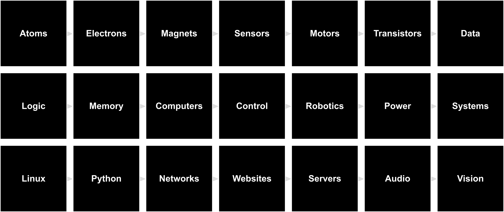

# The Last Black Box : *Experimental Neuroscience Bootcamp*

> **LBB-103**: A one-week ***Bootcamp Version*** of the Last Black Box course for Neuroscience researchers

 
The <b>black boxes</b> you will open during Bootcamp

----

## NB3

You will be building a brain for your robot. The robot's physical layout mimics the basic anatomy of a (vertebrate) brain. As you progress through the course, your robot will *evolve* into an increasingly sophisticated machine. The goal is to create an "intelligent" machine without using any **black boxes**. We thus call this robot the No-Black-Box-Brain or NBBB or ***NB3***.

----

## Schedule

### Day 1 - Sensors and Motors

- [Morning](01_analog-electronics/): Atoms, Electrons, and Sensors
- [Afternoon](02_magnets-and-semiconductors/): Magnets, Motors, and Transistors

### Day 2 - Computers and Robotics

- [Morning](03_digital-computers/): Data, Logic, Memory, and Computers
- [Afternoon](04_robot-control/): Control and Robotics

### Day 3 - Systems and Networks

- [Morning](05_software-systems/): Power, Systems, Linux, and Python
- [Afternoon](06_the-internet/): Networks, Websites, and Servers

### Day 4 - Audio

- [Morning](07_microphones-and-speakers/): Audio input and output hardware
- [Afternoon](08_signal_processing/): Signal processing (1-D data)

### Day 5 - Images

- [Morning](09_cameras/): Image acquisition hardware
- [Afternoon](10_computer-vision/): Image processing (2-D data)

---

## License

 The entire LastBlackBox repository and website is licensed under a <a rel="license" href="http://creativecommons.org/licenses/by-nc-sa/4.0/">Creative Commons Attribution-NonCommercial-ShareAlike 4.0 International License</a>.

---
