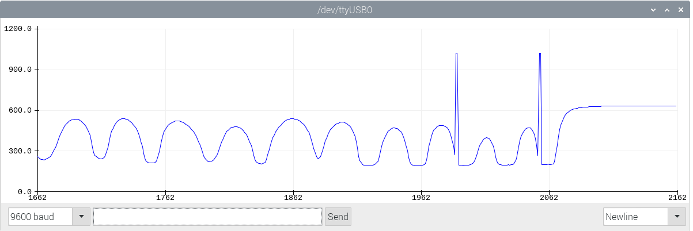
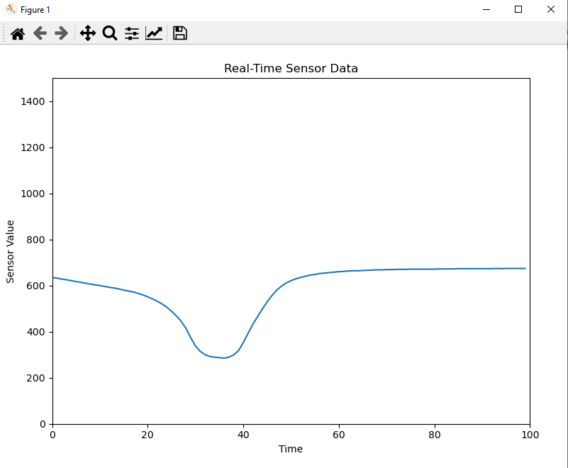

Longitudinal Data
==============

Morning session

You need
--------

- NB3 Robot

- Light sensor

- Microphone

- WiFi/SSH access to Raspberry Pi

- Python3 on your host computer

Goal
----
Today everything is about longitudinal, time-series data. We will use sensor data from the light sensor and stream it 
in real-time to your computer. Afterwards, we will focus on audio data and digital signal processing. Therefore, we will
record audio data and analyze the signal. Finally, we will let the robot react to the audio data if something special is
happening.

# Light Sensor

Task 1: Program the arduino to serial print the light sensor data
---------------------------
As you already learned on day 2, you can use the Arduino IDE to program the Arduino. Rebuild the setup where you read
the light sensor data and print it to the serial monitor.


Task 2: Look at the values by using the serial plotter of the Arduino IDE
------------------------------------
In case you did not discover it yet, the Arduino IDE has a serial plotter. You can find it under Tools -> Serial Plotter.
It is a visually more pleasing way to look at the data compared to the serial monitor.




Task 3: Receive the data on your raspberry pi and forward it to your host computer
--------------------------------------
We provide you the script "receive_and_send_sensor_data.py" which you can use to receive the data on your raspberry pi.
To forward the data to your host computer, you need to change the IP address in the script. Therefore, open the script
and change the IP address in the following line:

    SERVER_IP = "..."

You can find the IP by running the following command on your host computer:
For Windows:

    ipconfig

For Linux/Mac:
    
    ifconfig

There you have to look for the IP address of the network interface you are using to connect to the robot. It should be
something like `192.168.XXX.XXX`.

After you changed the IP address, you can run the script on your raspberry pi by executing the following command:

    python3 raspberry_pi/receive_and_send_sensor_data.py


Task 4: Receive the data at your host computer
-----------------------------------
You need to have python3 installed on your host computer. If you do not have it installed, we recommend to use
Anaconda to install python3. You can find the installation instructions here: https://www.anaconda.com/products/individual
After you installed Anaconda, you can run the script by executing the following command:

    python host_pc/receive_sensor_data_host.py

Note: You probably need to install the following packages:

    pip install numpy
    pip install matplotlib
    pip install pyserial

You can use the Python base environment to install the packages or create a new virtual environment. If you want to
create a new virtual environment, you can do it by executing the following command:

    conda create -n myenv python=3.8

Afterwards, you can activate the environment by executing the following command:
    
    conda activate myenv


Task 5: Plot the data in realtime
---------------------------------
After the script on the raspberry pi and the script on the host computer are running, you should see a plot like 
this on your host computer:



# Audio Data
Task 1: Follow the microphone installation instructions
---------------------------------
To install the microphone, please follow the instructions provided in the following link: [Microphone Installation Instructions](https://github.com/NoBlackBoxes/LastBlackBox/tree/master/boxes/audio/i2s)

Task 2: Record audio data
---------------------------------
Use "arecord" to record roughly 5 seconds of speech. 

```bash
arecord -D plughw:1 -c2 -r 48000 -f S32_LE -t wav -V stereo -v file_stereo.wav
```

Task 3: Load it on your host computer and plot it
---------------------------------
Transfer the recorded file to your host computer and plot it using matplotlib. For file transfer, you can use the commands as introduced before, or any other tool, such as WinSCP or FileZilla. 


Task 4: Record a whistling sound
---------------------------------
Repeat Task 1 and 2 but this time record a whistling sound. You will need it in the afternoon session.


TROUBLESHOOTING
===============

NOTE: This information may be outdated and only applicable to the NB3 kit from last year. Please disregard if using a different kit.

If you encounter missing drivers for the hearing modules, you can try the following solution:

```bash
make -C /lib/modules/5.10.103-v7l+/build M=/home/pi/LastBlackBox/boxes/hearing/i2s/driver modules
make[1]: *** /lib/modules/5.10.103-v7l+/build: No such file or directory.  Stop.
make: *** [Makefile:35: all] Error 2
```

In this case, you can attempt to resolve the issue by running the following command:

```bash
sudo apt-get install linux-headers
```

If you are experiencing issues with `pyaudio` on the Raspberry Pi, you can try the following solution:

```bash
sudo apt-get install portaudio19-dev
```
