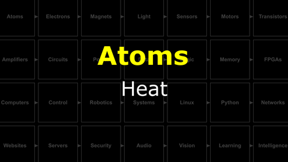

# The Last Black Box : Atoms
In this box, you will learn about atoms...

<i>Materials</i>

Name|Description| # |Package|Data|Link|
:-------|:----------|:-----:|:-:|:--:|:--:|
Periodic Table|Periodic Table Card|1|Body (000)|[-D-](/boxes/atoms/card)|[-L-](VK)

## Atoms
#### Watch this video: [Atomic Structure](https://vimeo.com/1000458082)

> A brief introduction to the physics of atoms, their parts (protons, neutrons, and electrons), and their classical vs. quantum structure.

- **TASK**: Draw your favorite atom in the "classical" style
> You should have the appropriate number of electrons in each orbital.

#### Watch this video: [The Periodic Table](https://vimeo.com/1028399080)

> Organizing the elements into a table reveals a regular pattern, which is linked to the fundamental chemical properties of each material.

- When you need it *(and you will)*, then you can find a copy of the periodic table [here](/boxes/atoms/_resources/images/periodic_table.png).
- The electron configuration (assignments to specific orbitals) of each atomic element can be viewed [here](https://en.wikipedia.org/wiki/Electron_configurations_of_the_elements_(data_page)).

### Chemistry
> Atoms with incomplete outer (valence) orbitals will try to complete their set of electrons by sharing, donating, or stealing electrons from other Atoms. This is called chemistry.

#### Watch this video: [Heat](https://vimeo.com/1029691491)

> Atoms in every material are always moving. This motion of atoms (their average kinetic energy) is heat.

### Nuclear Forces
> Wait. What's up with Hydrogen? Why no Neutrons? Oh...what about Helium? Why don't those Protons, with their positive charges, just fly apart?

### Fission and Fusion
> Not all Nuclei are stable, sometimes they can fall apart (fission). What if two atoms get *sooooo* close to one another that their Nuclei connect (fuse)? Lots of energy is released...and a new element forms.

# Projects
