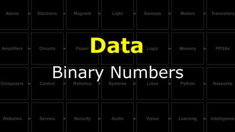
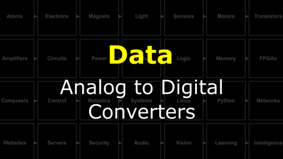

# The Last Black Box : Data
In this box, you will learn about data...

## Data
What is a data...for computers? for brains? How can machines decide what to do based on their inputs? A key concept in decision-making is threshold functions. If an input value goes above a threshold, a decision is triggered. How can we make such a trigger out of electronic circuit elements?

<i>Materials</i>

Name|Description| # |Package|Data|Link|
:-------|:----------|:-----:|:-:|:--:|:--:|

#### Watch this video: [Binary Numbers](https://vimeo.com/1033226788)

> All you need is 0 and 1. Here we will learn how to represent *anything* in binary.

- Write your name in binary (using the ASCII table) in either Hex or Decimal notation.

#### Watch this video: [Analog to Digital Converters](https://vimeo.com/1033223967)

> Moving signals from the analog world to the digital world requires converting a continuous voltage into discrete binary values. We can accomplish this with an analog to digital converter, or **ADC**, and here we learn how they work.

- Build the input stage for a 2-bit ADC using the LM339/LM2901 comparator and a resistor ladder.

# Project
### NB3 : Build an ADC (input)
> Use a comparator to convert analog values into discrete levels.

<weak>Guide</weak>

:-:-: A video guide to completing this project can be viewed <a href="https://vimeo.com/1034767170" target="_blank" rel="noopener noreferrer">here</a>.

