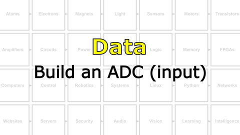

# The Last Black Box : Data
In this box, you will learn about data...

<i>Materials</i>

Name|Description| # |Package|Data|Link|
:-------|:----------|:-----:|:-:|:--:|:--:|
Comparator|LM339 (DIP-14)|2|Active Electronics|[-D-](/boxes/data/_resources/datasheets/lm2901.pdf)|[-L-](https://uk.farnell.com/texas-instruments/lm2901n/ic-comparator-quad-2901-dip14/dp/3118410)

## Data
#### Watch this video: [Binary Numbers](https://vimeo.com/1033226788)

> All you need is 0 and 1. Here we will learn how to represent *anything* in binary.

- Write your name in binary (using the ASCII table) in either Hex or Decimal notation.

#### Watch this video: [Analog to Digital Converters](https://vimeo.com/1033223967)

> Moving signals from the analog world to the digital world requires converting a continuous voltage into discrete binary values. We can accomplish this with an analog to digital converter, or **ADC**, and here we learn how they work.

- Build the input stage for a 2-bit ADC using the LM339/LM2901 comparator and a resistor ladder.

# Projects
#### Watch this video: [NB3 : Build an ADC (input)](https://vimeo.com/1034767170)

> Use a comparator to convert analog values into discrete levels.

