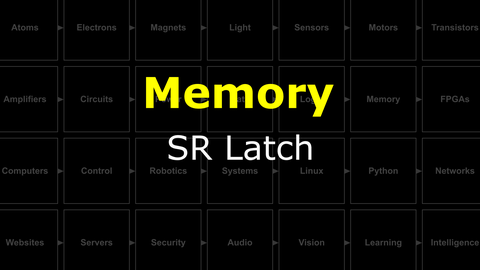

# The Last Black Box : Memory
In this box, you will learn about memory...

## Memory
There are many ways to store information.

<i>Materials</i>

Name|Description| # |Package|Data|Link|
:-------|:----------|:-----:|:-:|:--:|:--:|

#### Watch this video: [Flash Memory](https://vimeo.com/1033230293)

> Storing much of your data requires *quantum mechanics*.

#### Watch this video: [SR Latch](https://vimeo.com/1033238234)

> Logic gates with feedback can hold onto their values...they can remember.

- Understand the role of feedback in an SR latch

### Flip Flop
> If we add a clock to our memory, then we can synchronize the operation of our logic circuit.

- Build an D Flip Flop

# Project
### NB3 : Building an SR Latch
> Let's build and test an SR latch from NAND gates.

<weak>Guide</weak>

:-:-: A video guide to completing this project can be viewed <a href="https://vimeo.com/1033234541" target="_blank" rel="noopener noreferrer">here</a>.

- Build an SR latch, follow the video guide

