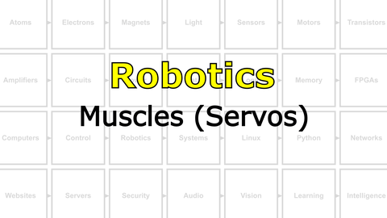
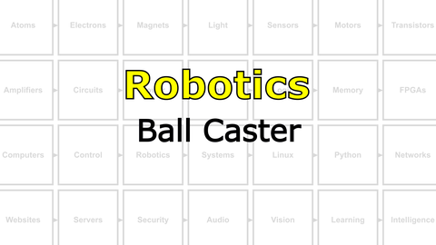
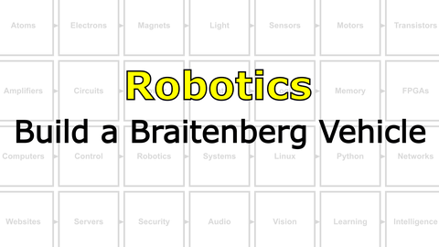

# The Last Black Box : Robotics
In this box, you will learn about robotics...

<details><summary><i>Materials</i></summary><p>

Name|Description| # |Package|Data|Link|
:-------|:----------|:-----:|:-:|:--:|:--:|
Servo Motor|FT90R Digital Micro Continuous Rotation Servo|2|Large (100)|[-D-](/boxes/control/)|[-L-](https://www.pololu.com/product/2817)
Servo Wheel|Wheels (70x8mm) for servos|2|Large (100)|[-D-](/boxes/control/)|[-L-](https://www.pololu.com/product/4925)
Servo Mount|Mount for servo motor|2|Acrylic Mounts|[-D-](/boxes/robotics/)|[-L-](VK)
M2.5 bolt (6)|6 mm long M2.5 bolt|8|Mounting Hardware|[-D-](/boxes/robotics/)|[-L-](https://www.accu.co.uk/pozi-pan-head-screws/9255-SPP-M2-5-6-A2)
M2.5 standoff (12/SS)|12 mm long socket-to-socket M2.5 standoff|4|Mounting Hardware|[-D-](/boxes/robotics/)|[-L-](https://uk.farnell.com/wurth-elektronik/970120151/standoff-hex-female-female-12mm/dp/2884528)
Caster|0.75 inch metal ball caster|1|Large (100)|[-D-](/boxes/robotics/https://www.pololu.com/product/955)|[-L-](https://www.pololu.com/product/955)
Spacer|NB3 spacer 3 mm spacer for mounting ball caster|5|Acrylic Mounts|[-D-](/boxes/robotics/NB3_spacer)|[-L-](VK)
Motor Mount|Mount for TT Gearbox DC Motors - L-Bracket Type with hardware|2|Large (100)|[-D-](/boxes/robotics/)|[-L-](https://www.adafruit.com/product/3768)
DC Gearbox Motor|TT Gearbox DC Motor - 200RPM - 3 to 6VDC and wheel|2|Large (100)|[-D-](/boxes/control/)|[-L-](https://www.amazon.co.uk/AEDIKO-Motor-Gearbox-Shaft-200RPM/dp/B09V7QH1S8)

</p></details><hr>

## Robotics
### Reflexes
> Simple sensory-motor loops that underlie essential behaviour.


# Projects
#### Watch this video: [NB3 : Muscles (Servos)](https://vimeo.com/1034800702)
<p align="center">
<a href="https://vimeo.com/1034800702" title="Control+Click to watch in new tab"></a>
</p>

> Let's build your robot's movement system (using servo motors).

- **TASK**: Mount the servo motors and wheels to your NB3.
> The mounted servo motors should look like this.
- In order to control your servo motors, you must send a square wave signal from your NB3's hindbrain with very specific timing. The details of this control signal's timing are described in the comments of the example code here: [Servo Test (Arduino)](/boxes/robotics/programming/arduino/muscles_test_servo/muscles_test_servo.ino).
- This servo test code uses a library, called "servo", to make it easier to control your NB3's muscles.
- *code*
```c
#include <Servo.h>  // This includes the "servo" library

Servo left, right;  // This creates two servo objects, one for each motor

int speed = 0;      // This creates a variable called "speed" that is initially set to 0

// Setup
void setup() {
  right.attach(9);  // Assign right servo to digital (PWM) pin 9 (change according to your connection)
  left.attach(10);  // Assign left servo to digital (PWM) pin 10 (change according to your connection)
}

void loop() {

  // Servos are often used to control "angle" of the motor, therefore the "servo library" uses a range of 0 to 180.
  // Your servos control "speed", therefore 0 is full speed clockwise, 90 is stopped, and 180 is full speed counter-clockwise

  // Move left servo through the full range of speeds
  for (speed = 0; speed <= 180; speed += 1) {
    left.write(speed);
    delay(15);
  }
  left.write(90); // stop left servo

  // Move right servo
  for (speed = 0; speed <= 180; speed += 1) {
    right.write(speed);
    delay(15);
  }
  right.write(90); // stop right servo
}
```
- **TASK**: Test your servo motors by sending control commands from your NB3's hindbrain.
> One servo motor should spin forwards and backwards, then the other...and then repeat.

### NB3 : Muscles (DC Gear Motors)
> Let's build your robot's movement system (using brushed DC gear motors).

- **TASK**: Mount the DC gear motors and wheels to your NB3.
> The mounted DC gear motors should look like this.

#### Watch this video: [NB3 : Ball Caster](https://vimeo.com/1034797327)
<p align="center">
<a href="https://vimeo.com/1034797327" title="Control+Click to watch in new tab"></a>
</p>

> Let's add a front wheel (ball caster) to keep your NB3 from dragging its face on the ground.

- **TASK**: Mount caster (ball bearing) to the front of your NB3.
> The ball caster mount should look like this.

#### Watch this video: [NB3 : Build a Braitenberg Vehicle](https://vimeo.com/1034798460)
<p align="center">
<a href="https://vimeo.com/1034798460" title="Control+Click to watch in new tab"></a>
</p>

> Here we create the first Braitenberg Vehicle, a simple sensory-motor feedback loop connecting two light sensors to the motion of two wheels.

- A Braitenberg Vehicle can show complex behaviour, appearing to seek out light and avoid shadows, but the underlying control circuit is extremely simple.
<p align="center">

</p>

- A small change to the control circuit can completely change how your NB£ "vehicle" responds to light.
- **TASK**: Measure two light sensors and *decide* how to activate the direction of your two wheels in response.
- Some example code to get you started can be found here: [Braitenberg Vehicle (Arduino)](/boxes/robotics/programming/arduino/braitenberg_vehicle/braitenberg_vehicle.ino)
> You should have created a robot that either likes (turns toward) or avoids (turns away from) light.

