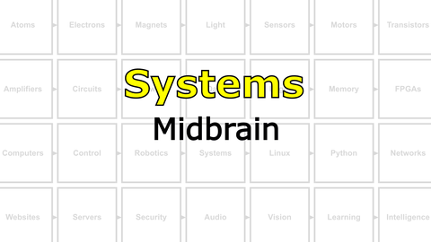
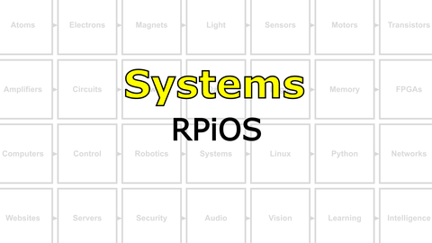

# The Last Black Box : Systems
In this box, you will learn about systems...

## Systems
Modern computers combine a huge number of different technologies into a functional "system". They still need a core CPU and memory (RAM), but also a graphics processor, a network connection (wired and wireless), and other specialized hardware. All of these hardware devices are coordinated by a sophisticated (and complex) piece of software called an *operating system*.

<i>Materials</i>

Name|Description| # |Package|Data|Link|
:-------|:----------|:-----:|:-:|:--:|:--:|
Computer (RPi4)|Raspberry Pi 4b with 2 GB RAM|1|Medium (011)|[-D-](/boxes/systems/_resources/datasheets/rpi4b.pdf)|[-L-](https://uk.farnell.com/raspberry-pi/rpi4-modbp-2gb/raspberry-pi-4-model-b-2gb/dp/3051886)
Power Jumper (Red)|Thick gauge (22 AWG) jumper wire (red insulation) 1Px2 to 2S|1|Cables (001)|[-D-](/boxes/systems/)|[-L-](VK)
Power Jumper (Black)|Thick gauge (22 AWG) jumper wire (black insulation) 1P to 1S|2|Cables (001)|[-D-](/boxes/systems/)|[-L-](VK)
Heatsinks|Heatsinks for RPi 4b chips|1|Large (100)|[-D-](/boxes/systems/_resources/datasheets/rpi4b_heatsinks.jpg)|[-L-](https://www.amazon.co.uk/gp/product/B07VRNT3HX)
SD Card|16 GB micro SD card|1|Large (100)|[-D-](/boxes/systems/_resources/datasheets/SanDisk-SDSQUAR-016G-GN6MA-datasheet.pdf)|[-L-](https://uk.farnell.com/integral/inmsdh16g-100v10/16gb-microsdhc-v10-uhs-i-u1/dp/3498606)
M2.5 bolt (6)|6 mm long M2.5 bolt|8|Mounting Hardware|[-D-](/boxes/robotics/)|[-L-](https://www.accu.co.uk/pozi-pan-head-screws/9255-SPP-M2-5-6-A2)
M2.5 standoff (20/SS)|20 mm long socket-to-socket M2.5 standoff|4|Mounting Hardware|[-D-](/boxes/systems/)|[-L-](https://uk.farnell.com/wurth-elektronik/970200154/standoff-hex-female-female-20mm/dp/2987903)

#### Watch this video: [Multi-Tasking](https://vimeo.com/1036086160)

> Back when computers were very expensive mainframes, some clever software engineers developed strategies to share the computer's resources between multiple users, running multiple different tasks, at the same time. These "scheduling" programs still form the basis of our modern **multi-tasking** operating systems.

**TASK**: Develop a multi-tasking "scheduling" program for your microcontroller.

<strong>Target</strong>

    Changing the timescale of one task should not affect the other.

#### Watch this video: [Operating Systems](https://vimeo.com/1036096746)

> As computer hardware became much more capable, software was developed to manage this complexity and power. This software took responsibility for managing access to the computer's resources: processing, memory, and devices. These days, when we *operate* a computer, we rarely interact directly with the hardware. Instead, we talk to this control software, which we call an **operating system**.

**TASK**: Install the Linux-based Raspberry Pi OS on your NB3
- - Follow these [RPiOS installation instructions](/boxes/systems/rpios/README.md)

<strong>Target</strong>

    Booted!

#### Watch this video: [NB3 : Midbrain](https://vimeo.com/1036089510)

> Now we will add a more powerful computer (Raspberry Pi) to your NB3's midbrain.

**TASK**: Mount a Raspberry Pi on your robot (and connect its power inputs using your *shortest* jumper cables, 2x5V and 2x0V from the NB3, to the correct GPIO pins on the RPi...please *double-check* the pin numbers)
- - This pinout of the Raspberry Pi GPIO might be useful: [Raspberry Pi GPIO](/boxes/systems/_resources/images/rpi_GPIO_pinout.png)

<strong>Target</strong>

    A powered and blinking RPi midbrain.

#### Watch this video: [NB3 : RPiOS](https://vimeo.com/1036095710)

> After mounting and wiring your NB3's midbrain computer, you must now give it some core software to run...an operating system.

**TASK**: Install the Linux-based Raspberry Pi OS on your NB3
- - Follow these [RPiOS installation instructions](/boxes/systems/rpios/README.md)

<strong>Target</strong>

    Booted!

#### Watch this video: [NB3 : Connecting to RPi](https://vimeo.com/1036391512)

> When you have installed your NB3's operating system, then you can power it on and try to connect to it from your Host computer over WiFi or UART.

**TASK**: Connect to your NB3 via WiFi
- - Follow these instruction [Connecting to RPi](/boxes/systems/connecting/README.md)
- - We currently recommend setting up a UART connection to your RPi for debugging when things go wrong. It is a few extra steps, but it can save you days! [Connecting to RPi via UART](/boxes/systems/connecting/uart/README.md)

<strong>Target</strong>

    Connected!

#### Watch this video: [Visual Studio Code](https://vimeo.com/1036716612)

> We will be using Visual Studio Code (VS Code) as our tool for writing programs. VS Code is just a simple, *but really powerful*, text editor. It has extensions for all sorts of useful tools (Python, Git, etc.), and for connecting to a "remote" computer (our NB3's midbrain).

# Project
### NB3 : Programming Concurrency (Arduino)
> Getting a microcontroller to perform two tasks (with very different timescales) at the same time is a fun programming challenge. You will develop new skills in organizing your programs and get a glimpse of the problems solved by the *kernel* of a modern operating system.

<weak>Guide</weak>

:-:-: A video guide to completing this project can be viewed <a href="https://vimeo.com/1036094397" target="_blank" rel="noopener noreferrer">here</a>.

