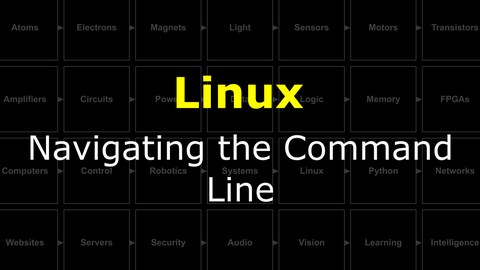
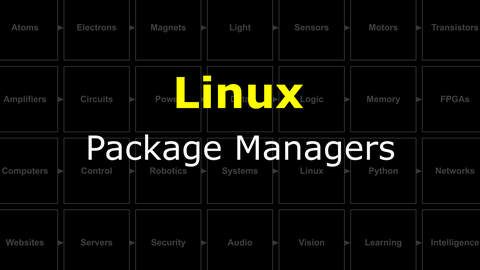
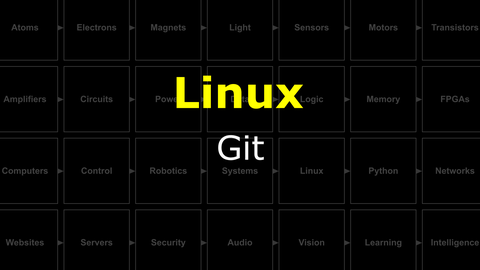

# The Last Black Box : Linux
In this box, you will learn about linux...

<details><summary><i>Materials</i></summary><p>

Name|Description| # |Package|Data|Link|
:-------|:----------|:-----:|:-:|:--:|:--:|

</p></details><hr>

## Linux
#### Watch this video: [Navigating the Command Line](https://vimeo.com/1036829527)
<p align="center">
<a href="https://vimeo.com/1036829527" title="Control+Click to watch in new tab"></a>
</p>

> The original user interfaces were entirely based on text. You typed commands as a line of text into your terminal console and received the result as a string of characters on the screen. Navigating this **command line** remains a useful skill, and a necessary one when working with remote machines.

- **TASK**: Explore Linux. Spend any extra time you have fiddling, playing with the UNIX approach to controlling a computer. Create some folders. Edit some files.
> You should see this in the command line.

#### Watch this video: [Package Managers](https://vimeo.com/1036834036)
<p align="center">
<a href="https://vimeo.com/1036834036" title="Control+Click to watch in new tab"></a>
</p>

> Installing and "managing" software can get complicated. Programs that help coordinate this process are called **package managers**.


#### Watch this video: [Git](https://vimeo.com/1036825331)
<p align="center">
<a href="https://vimeo.com/1036825331" title="Control+Click to watch in new tab"></a>
</p>

> Git is a program that keeps track of changes to your files. It is very useful when developing code. This entire course is stored as a git "repository" on GitHub.

- **TASK**: "Clone" (copy) all of the contents in the LastBlackBox GitHub repository directly to your NB3's midbrain. **It is very important that you clone the LBB repo to a specific folder ("NoBlackBoxes") in your NB3's home directory**.
> *Why?* Most of the code examples assume that the repo is stored in this location. If you prefer to put it somewhere else, then you must be comfortable modifying the "repo root" path used in the examples.
 - *code*
```bash
cd $HOME            # Navigate to your "Home" directory
mkdir NoBlackBoxes  # Create NoBlackBoxes directory
cd NoBlackBoxes     # Change to NoBlackBoxes directory

# Clone LBB repo (only the most recent version)
git clone --depth 1 https://github.com/NoBlackBoxes/LastBlackBox
```
> You should now have a complete copy of the LBB repo on your NB3.

# Projects
