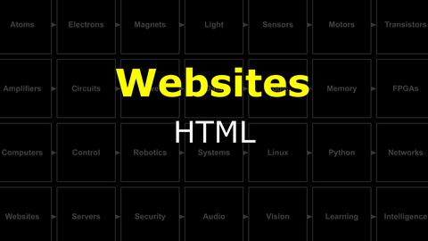
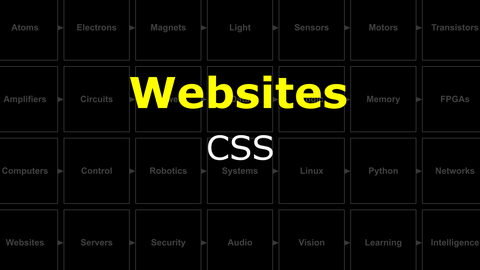
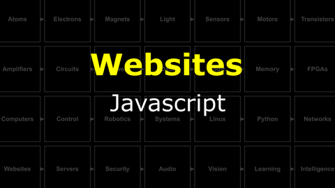

# The Last Black Box : Websites
In this box, you will learn about websites...

## Websites
Creating a website, from simple to complex.

<i>Materials</i>

Name|Description| # |Package|Data|Link|
:-------|:----------|:-----:|:-:|:--:|:--:|

#### Watch this video: [HTML](https://vimeo.com/1134724080)

> Hyper-text markup language (HTML) is the data format of the world-wide-web. When you "visit a website" you are simply asking for an HTML file. What is an HTML file? It is just a text file with some special "<tags>" that control how the contents of the file should be displayed. The program you use to request these and display these files is called a *web browser*.

- Create an HTML file. You can start from the simple template here: [HTML (simple)](/boxes/websites/html/simple.html)
- - You should do this on your PC (not NB3) in a VS Code window (or any text editor)
- Open your HTML file in a browser on your PC. Do you see your awesome website?
- Add some more complex layout to your website. Here is an example: [HTML (layout)](/boxes/websites/html/layout.html)
- Find a cool website on the internet. Use the developer tools in your internet browser to "explore" the mess of HTML that underlies this website...and maybe make some creative changes.

#### Watch this video: [CSS](https://vimeo.com/1134720724)

> Webpages often have a consistent "style" across an entire website. It is possible to create and maintain this style by directly including the same style tags (colors, fonts, margins, etc.) in every HTML page, but this is difficult to maintain and tedious to update. Cascading Style Sheets (CSS) allow you to put all of your "styling" into a single file that can be included on the pages that need it, giving you one place to make tweaks to the styling of your entire website.

- Create a "styles.css" for your website. Add a link to this "stylesheet" in your HTML code. You can start with the examples (HTML and CSS) here: [CSS Examples](/boxes/websites/css/)
- Make your site look cool, and *consistent* across different pages.

#### Watch this video: [Javascript](https://vimeo.com/1134729863)

> Javascript is the web browser's programming (scripting) language. It has very little to do with Java, but it is the main way to add "interaction" to websites. Everyone should know a little bit of Javascript. Also, given that everyone has access to a web browser, it is one of the easiest programming environments to setup and start playing around.

- Add some (Javascript) code to your website to make it more interactive.
- Here is an example to respond to a "button press" by hiding/revealing the navigation bar in a simple website: [Button Response](/boxes/websites/javascript/alternates/toggle.js)
- Here is another example to gets the current time and updates a live clock page: [Live Clock](/boxes/websites/javascript/alternates/clock.js)
- There is way more you can do with Javascript. Have fun exploring and learning!

# Project
