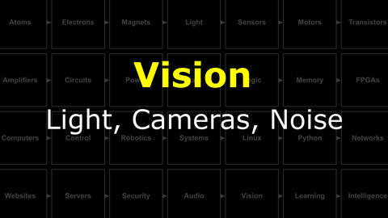
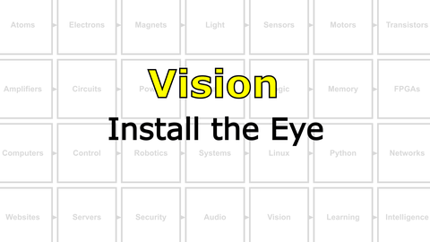

# The Last Black Box : Vision
In this box, you will learn about vision...

<details><summary><i>Materials</i></summary><p>

Name|Description| # |Package|Data|Link|
:-------|:----------|:-----:|:-:|:--:|:--:|
Camera (RPi v3)|RPi color camera with auto-focus (version 3)|1|Medium (011)|[-D-](/boxes/vision/_resources/datasheets/rpi_camera_v3.pdf)|[-L-](https://uk.farnell.com/raspberry-pi/sc0872/rpi-camera-mod-3-standard-lens/dp/4132318)
NB3 Camera Mount|Custom laser cut mount for RPi camera|1|Acrylic Mounts|[-D-](/boxes/vision/NB3_camera_mount)|[-L-](VK)
NB3 Cortex Mount|Custom laser cut holder for NPU|1|Acrylic Mounts|[-D-](/boxes/vision/NB3_cortex_mount)|[-L-](VK)
M2.5 bolt (6)|6 mm long M2.5 bolt|4|Mounting Hardware|[-D-](/boxes/robotics/)|[-L-](https://www.accu.co.uk/pozi-pan-head-screws/9255-SPP-M2-5-6-A2)
M2.5 standoff (20/PS)|20 mm long plug-to-socket M2.5 standoff|4|Mounting Hardware|[-D-](/boxes/vision/)|[-L-](https://uk.farnell.com/wurth-elektronik/971200151/standoff-hex-male-female-20mm/dp/2884418)
M3 nut (square)|square M3 nut 1.8 mm thick|1|Mounting Hardware|[-D-](/boxes/audio/-)|[-L-](https://www.accu.co.uk/flat-square-nuts/21326-HFSN-M3-A2)
M3 bolt (12)|12 mm long M3 bolt|1|Mounting Hardware|[-D-](/boxes/vision/)|[-L-](https://www.accu.co.uk/pozi-pan-head-screws/500116-SPP-M3-12-ST-BZP)
M2 bolt (8)|8 mm long M2 bolt|4|Mounting Hardware|[-D-](/boxes/audio/)|[-L-](https://www.accu.co.uk/pozi-pan-head-screws/500101-SPP-M2-8-ST-BZP)
M2 nut|regular M2 nut|4|Mounting Hardware|[-D-](/boxes/audio/)|[-L-](https://www.accu.co.uk/hexagon-nuts/456429-HPN-M2-C8-Z)

</p></details><hr>

## Vision
#### Watch this video: [Light, Cameras, Noise](https://vimeo.com/manage/videos/1141367902)
<p align="center">
<a href="https://vimeo.com/manage/videos/1141367902" title="Control+Click to watch in new tab"></a>
</p>

> We start with a recap about light, measuring analog signals with computers, and then describe how a modern camera sensor is built. We then introduce the NB3's Eye and conclude with a discussion of the sources of noise that all cameras encounter when trying to *image* the real world.


### Image-Processing
> Old-school (classical) techniques for processing two-dimensional data (2D).

- Install python opencv
- *code*
```bash
pip install opencv-python
```

# Projects
#### Watch this video: [NB3 : Install the Eye](https://vimeo.com/1042945461)
<p align="center">
<a href="https://vimeo.com/1042945461" title="Control+Click to watch in new tab"></a>
</p>

> Let's install a camera on your NB3.

- Test your camera with the following command
```bash
# Capture a still image and save it to a file
rpicam-still -o my_test.png

# The image will appear in the same folder where the command was run
```

#### Watch this video: [NB3 : Streaming Images](https://vimeo.com/manage/videos/1141582696)
<p align="center">
<a href="https://vimeo.com/manage/videos/1141582696" title="Control+Click to watch in new tab"></a>
</p>

> Let's stream live images from your NB3's camera to any web browser.


